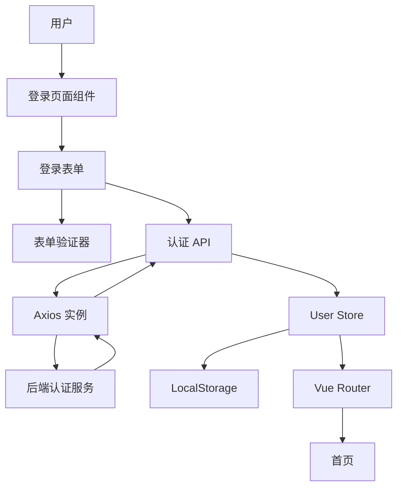

# 技术设计文档 - 登录页面

## 概述

登录页面是用户访问系统的入口点，负责用户身份验证和会话建立。本设计基于 Vue 3 Composition API、TypeScript、Element Plus UI 组件库实现，与后端认证服务集成，提供安全、流畅的登录体验。

核心功能包括：
- 支持手机号或邮箱登录的表单验证
- JWT token 的获取和持久化存储
- 用户信息的状态管理
- 路由守卫保护
- 统一的 HTTP 请求拦截和错误处理

## 架构

### 系统架构



### 技术栈

- **前端框架**: Vue 3 (Composition API)
- **类型系统**: TypeScript
- **UI 组件库**: Element Plus
- **状态管理**: Pinia
- **路由管理**: Vue Router
- **HTTP 客户端**: Axios
- **构建工具**: Vite

### 分层架构

1. **视图层 (View Layer)**
   - `LoginPage.vue`: 登录页面容器组件
   - 负责页面布局和样式

2. **业务逻辑层 (Business Logic Layer)**
   - `useLoginForm.ts`: 登录表单逻辑组合式函数
   - `validators.ts`: 表单验证规则
   - 负责表单状态管理和验证逻辑

3. **数据访问层 (Data Access Layer)**
   - `authApi.ts`: 认证 API 接口
   - `axios.ts`: Axios 实例配置
   - 负责与后端服务通信

4. **状态管理层 (State Management Layer)**
   - `userStore.ts`: 用户状态 Pinia store
   - 负责用户信息和 token 的管理

5. **路由层 (Routing Layer)**
   - `router/index.ts`: 路由配置
   - `router/guards.ts`: 路由守卫
   - 负责页面导航和访问控制

## 组件和接口

### 组件结构

#### LoginPage.vue

登录页面容器组件，负责页面布局。

```typescript
// 组件职责：
// - 提供居中布局容器
// - 渲染系统标题/Logo
// - 集成登录表单组件

<template>
  <div class="login-page">
    <div class="login-container">
      <div class="login-header">
        <h1>系统登录</h1>
      </div>
      <el-form
        ref="formRef"
        :model="formData"
        :rules="rules"
        class="login-form"
        @submit.prevent="handleLogin"
      >
        <el-form-item prop="username">
          <el-input
            v-model="formData.username"
            placeholder="请输入手机号或邮箱"
            :prefix-icon="User"
            size="large"
            @keyup.enter="handleLogin"
          />
        </el-form-item>
        <el-form-item prop="password">
          <el-input
            v-model="formData.password"
            type="password"
            placeholder="请输入密码"
            :prefix-icon="Lock"
            size="large"
            show-password
            @keyup.enter="handleLogin"
          />
        </el-form-item>
        <el-form-item>
          <el-button
            type="primary"
            size="large"
            :loading="loading"
            :disabled="!isFormValid"
            @click="handleLogin"
            style="width: 100%"
          >
            登录
          </el-button>
        </el-form-item>
      </el-form>
    </div>
  </div>
</template>

// 样式要求：
// - 表单宽度: 400px
// - 垂直和水平居中
// - 响应式设计（PC 端优先）
```

#### useLoginForm.ts

登录表单逻辑组合式函数。

```typescript
interface LoginFormData {
  username: string;  // 手机号或邮箱
  password: string;
}

interface UseLoginFormReturn {
  formData: Ref<LoginFormData>;
  formRef: Ref<FormInstance | undefined>;
  rules: FormRules;
  loading: Ref<boolean>;
  isFormValid: ComputedRef<boolean>;
  handleLogin: () => Promise<void>;
}

export function useLoginForm(): UseLoginFormReturn {
  // 表单数据
  // 表单验证规则
  // 登录处理逻辑
  // 错误处理
}
```

### API 接口

#### authApi.ts

认证相关 API 接口。

```typescript
// 登录请求参数
interface LoginRequest {
  username: string;  // 手机号或邮箱
  password: string;
}

// 登录响应数据
interface LoginResponse {
  token: string;
  userId: string;
  username: string;
  nickname: string;
  roles: string[];
  permissions: string[];
  menus: MenuItem[];
}

// 菜单项
interface MenuItem {
  id: string;
  name: string;
  path: string;
  icon?: string;
  children?: MenuItem[];
}

// 登录 API
export async function login(data: LoginRequest): Promise<LoginResponse> {
  const response = await axios.post<LoginResponse>('/auth/login', data);
  return response.data;
}
```

### 状态管理

#### userStore.ts

用户状态 Pinia store。

```typescript
interface UserState {
  token: string | null;
  userId: string | null;
  username: string | null;
  nickname: string | null;
  roles: string[];
  permissions: string[];
  menus: MenuItem[];  // 仅保存在内存中
}

export const useUserStore = defineStore('user', {
  state: (): UserState => ({
    token: null,
    userId: null,
    username: null,
    nickname: null,
    roles: [],
    permissions: [],
    menus: []
  }),
  
  getters: {
    isLoggedIn: (state) => !!state.token,
    hasPermission: (state) => (permission: string) => 
      state.permissions.includes(permission),
    hasRole: (state) => (role: string) => 
      state.roles.includes(role)
  },
  
  actions: {
    // 设置用户信息（登录成功后调用）
    setUserInfo(data: LoginResponse): void,
    
    // 从 localStorage 恢复用户信息
    restoreUserInfo(): void,
    
    // 清除用户信息（退出登录）
    clearUserInfo(): void,
    
    // 登录
    async login(credentials: LoginRequest): Promise<void>
  }
});
```

### 路由配置

#### router/guards.ts

路由守卫配置。

```typescript
export function setupRouterGuards(router: Router): void {
  router.beforeEach((to, from, next) => {
    const userStore = useUserStore();
    const isLoggedIn = userStore.isLoggedIn;
    const requiresAuth = to.meta.requiresAuth;
    
    // 逻辑：
    // 1. 如果访问需要认证的路由但未登录 -> 重定向到登录页
    // 2. 如果已登录访问登录页 -> 重定向到首页
    // 3. 保存原始目标路由用于登录后跳转
  });
}
```

### Axios 配置

#### axios.ts

Axios 实例配置和拦截器。

```typescript
const axiosInstance = axios.create({
  baseURL: 'http://localhost:8080',
  timeout: 10000,
  headers: {
    'Content-Type': 'application/json'
  }
});

// 请求拦截器
axiosInstance.interceptors.request.use(
  (config) => {
    const userStore = useUserStore();
    
    // 添加 Authorization header
    if (userStore.token) {
      config.headers.Authorization = `Bearer ${userStore.token}`;
    }
    
    // 添加 X-User-Id header
    if (userStore.userId) {
      config.headers['X-User-Id'] = userStore.userId;
    }
    
    return config;
  },
  (error) => Promise.reject(error)
);

// 响应拦截器
axiosInstance.interceptors.response.use(
  (response) => response,
  (error) => {
    // 401 错误处理：清除 token 并重定向到登录页
    if (error.response?.status === 401) {
      const userStore = useUserStore();
      userStore.clearUserInfo();
      router.push('/login');
    }
    return Promise.reject(error);
  }
);
```

### 验证器

#### validators.ts

表单验证规则。

```typescript
// 手机号正则
const PHONE_REGEX = /^1\d{10}$/;

// 邮箱正则
const EMAIL_REGEX = /^[a-zA-Z0-9._%+-]+@[a-zA-Z0-9.-]+\.[a-zA-Z]{2,}$/;

// 验证账号（手机号或邮箱）
export function validateUsername(rule: any, value: string, callback: any): void {
  if (!value) {
    callback(new Error('请输入手机号或邮箱'));
  } else if (!PHONE_REGEX.test(value) && !EMAIL_REGEX.test(value)) {
    callback(new Error('请输入有效的手机号或邮箱地址'));
  } else {
    callback();
  }
}

// 验证密码
export function validatePassword(rule: any, value: string, callback: any): void {
  if (!value) {
    callback(new Error('请输入密码'));
  } else if (value.length < 6) {
    callback(new Error('密码至少 6 个字符'));
  } else {
    callback();
  }
}

// 表单验证规则
export const loginFormRules: FormRules = {
  username: [
    { required: true, validator: validateUsername, trigger: 'blur' }
  ],
  password: [
    { required: true, validator: validatePassword, trigger: 'blur' }
  ]
};
```

## 数据模型

### 前端数据模型

#### LoginFormData

登录表单数据模型。

```typescript
interface LoginFormData {
  username: string;  // 手机号或邮箱，非空
  password: string;  // 密码，最少 6 位
}
```

#### UserInfo

用户信息数据模型。

```typescript
interface UserInfo {
  token: string;           // JWT token
  userId: string;          // 用户 ID
  username: string;        // 用户名（手机号或邮箱）
  nickname: string;        // 昵称
  roles: string[];         // 角色列表
  permissions: string[];   // 权限列表
  menus: MenuItem[];       // 菜单列表（仅内存）
}
```

#### MenuItem

菜单项数据模型。

```typescript
interface MenuItem {
  id: string;              // 菜单 ID
  name: string;            // 菜单名称
  path: string;            // 路由路径
  icon?: string;           // 图标
  children?: MenuItem[];   // 子菜单
}
```

### LocalStorage 数据结构

存储在 localStorage 中的数据：

```typescript
// key: 'user_token'
// value: string (JWT token)

// key: 'user_info'
// value: JSON string
{
  "userId": "string",
  "username": "string",
  "nickname": "string",
  "roles": ["string"],
  "permissions": ["string"]
}
```

注意：`menus` 字段不存储在 localStorage 中，仅保存在 Pinia store 的内存状态中。

### 后端 API 数据模型

#### POST /auth/login

请求：
```json
{
  "username": "string",  // 手机号或邮箱
  "password": "string"
}
```

响应（成功 - 200）：
```json
{
  "token": "string",
  "userId": "string",
  "username": "string",
  "nickname": "string",
  "roles": ["string"],
  "permissions": ["string"],
  "menus": [
    {
      "id": "string",
      "name": "string",
      "path": "string",
      "icon": "string",
      "children": []
    }
  ]
}
```

响应（失败）：
- 401: 手机号/邮箱或密码错误
- 403: 账户已被锁定或禁用
- 500: 服务器内部错误

## 正确性属性


*属性是一个特征或行为，应该在系统的所有有效执行中保持为真——本质上是关于系统应该做什么的形式化陈述。属性作为人类可读规范和机器可验证正确性保证之间的桥梁。*

### 属性反思

在分析验收标准后，我识别出以下可以合并或优化的属性：

**合并机会：**
1. 属性 5.1（存储 token）和 5.2（存储用户信息）可以合并为一个综合属性：登录成功后的完整持久化
2. 属性 3.1（发送请求）和 3.2（请求体结构）可以合并：登录请求的完整性
3. 属性 8.3（Authorization header）和 8.4（X-User-Id header）可以合并：请求头的完整性

**冗余识别：**
- 属性 3.4（保存到 store）和属性 5.1/5.2（保存到 localStorage）有重叠，但它们测试不同的存储层，应该保留
- 属性 5.3（恢复数据）是 5.1/5.2 的往返测试，应该保留作为独立的往返属性

经过反思，我将创建以下精简的属性集合：

### 属性 1: 无效账号验证拒绝

*对于任何*不符合手机号格式（^1\d{10}$）且不符合邮箱格式（^[a-zA-Z0-9._%+-]+@[a-zA-Z0-9.-]+\.[a-zA-Z]{2,}$）的字符串，验证器应该拒绝该输入并返回错误消息。

**验证需求: 2.3**

### 属性 2: 短密码验证拒绝

*对于任何*长度小于 6 的字符串，密码验证器应该拒绝该输入并返回错误消息。

**验证需求: 2.4**

### 属性 3: 表单错误时按钮禁用

*对于任何*包含验证错误的表单状态，登录按钮应该保持禁用状态。

**验证需求: 2.5**

### 属性 4: 登录请求完整性

*对于任何*有效的登录凭证（username 和 password），当触发登录时，系统应该向 http://localhost:8080/auth/login 发送 POST 请求，且请求体包含 username 和 password 字段，值与输入一致。

**验证需求: 3.1, 3.2**

### 属性 5: 成功响应数据保存

*对于任何*包含 token、userId、username、nickname、roles、permissions 和 menus 的成功登录响应，User Store 应该将所有这些字段保存到状态中。

**验证需求: 3.4**

### 属性 6: 登录失败后按钮恢复

*对于任何*登录失败场景（401、403、500 或网络错误），登录按钮应该从加载状态恢复到可点击状态。

**验证需求: 4.5**

### 属性 7: 用户信息持久化

*对于任何*成功的登录响应，系统应该将 token 存储到 localStorage 的 'user_token' 键，将 userId、username、nickname、roles、permissions 存储到 localStorage 的 'user_info' 键（JSON 格式）。

**验证需求: 5.1, 5.2**

### 属性 8: 用户信息恢复往返

*对于任何*存储到 localStorage 的用户信息（token 和 user_info），当应用初始化时从 localStorage 恢复，应该得到相同的值。

**验证需求: 5.3**

### 属性 9: 有效 Token 允许访问

*对于任何*受保护的路由，当 localStorage 中存在有效 token 时，路由守卫应该允许访问该路由。

**验证需求: 5.4**

### 属性 10: 退出登录清除数据

*对于任何*存储在 localStorage 中的用户数据，当执行退出登录操作时，系统应该清除 'user_token' 和 'user_info' 键的所有数据。

**验证需求: 5.5**

### 属性 11: 未登录重定向

*对于任何*标记为需要认证的路由，当用户未登录（无 token）时访问，路由守卫应该重定向到登录页面。

**验证需求: 6.1**

### 属性 12: 原始路由保存

*对于任何*因未登录而被重定向的目标路由，系统应该保存该路由路径，以便登录成功后可以导航回去。

**验证需求: 6.3**

### 属性 13: 登录后导航

*对于任何*成功的登录操作，如果存在保存的原始目标路由，系统应该导航到该路由；否则导航到默认首页。

**验证需求: 6.4**

### 属性 14: 请求头自动注入

*对于任何*通过 Axios 实例发送的 HTTP 请求，当 User Store 中存在 token 时，请求头应该包含 `Authorization: Bearer {token}`；当存在 userId 时，请求头应该包含 `X-User-Id: {userId}`。

**验证需求: 8.3, 8.4**

## 错误处理

### 验证错误

表单验证错误通过 Element Plus 的表单验证机制处理：

1. **空值错误**
   - 账号为空：显示"请输入手机号或邮箱"
   - 密码为空：显示"请输入密码"
   - 触发时机：失去焦点（blur）

2. **格式错误**
   - 账号格式无效：显示"请输入有效的手机号或邮箱地址"
   - 密码长度不足：显示"密码至少 6 个字符"
   - 触发时机：失去焦点（blur）

3. **错误显示**
   - 使用 Element Plus FormItem 的错误提示
   - 错误消息显示在对应输入框下方
   - 红色文字提示

### API 错误

API 错误通过 Axios 响应拦截器和组件错误处理逻辑处理：

1. **401 未授权**
   - 错误消息：手机号/邮箱或密码错误
   - 处理：显示错误提示，保持在登录页

2. **403 禁止访问**
   - 错误消息：账户已被锁定或禁用，请联系管理员
   - 处理：显示错误提示，保持在登录页

3. **500 服务器错误**
   - 错误消息：登录失败，请稍后重试
   - 处理：显示错误提示，保持在登录页

4. **网络错误**
   - 错误消息：网络连接失败，请检查网络设置
   - 处理：显示错误提示，保持在登录页

5. **401 响应拦截**
   - 在 Axios 响应拦截器中全局处理
   - 自动清除 localStorage 中的 token 和用户信息
   - 自动重定向到登录页面
   - 适用于所有 API 请求，不仅限于登录

### 错误处理流程

```typescript
// 在 useLoginForm 中
async function handleLogin() {
  try {
    loading.value = true;
    
    // 表单验证
    await formRef.value?.validate();
    
    // 调用登录 API
    await userStore.login(formData.value);
    
    // 成功提示
    ElMessage.success('登录成功');
    
    // 导航
    const redirect = route.query.redirect as string;
    router.push(redirect || '/');
    
  } catch (error: any) {
    // 处理不同类型的错误
    if (error.response) {
      const status = error.response.status;
      switch (status) {
        case 401:
          ElMessage.error('手机号/邮箱或密码错误');
          break;
        case 403:
          ElMessage.error('账户已被锁定或禁用，请联系管理员');
          break;
        case 500:
          ElMessage.error('登录失败，请稍后重试');
          break;
        default:
          ElMessage.error('登录失败，请稍后重试');
      }
    } else if (error.request) {
      // 网络错误
      ElMessage.error('网络连接失败，请检查网络设置');
    } else {
      // 表单验证错误或其他错误
      console.error('Login error:', error);
    }
  } finally {
    loading.value = false;
  }
}
```

### 错误恢复策略

1. **表单验证错误**
   - 用户修正输入后自动重新验证
   - 所有错误消除后启用登录按钮

2. **API 错误**
   - 恢复登录按钮可点击状态
   - 允许用户重新尝试
   - 不清除已输入的表单数据

3. **会话过期（401）**
   - 全局拦截器自动处理
   - 清除本地存储
   - 重定向到登录页
   - 保存原始目标路由用于重新登录后跳转

## 测试策略

### 测试方法

本项目采用**双重测试方法**，结合单元测试和基于属性的测试，以确保全面的代码覆盖和正确性验证。

#### 单元测试

单元测试用于验证特定示例、边缘情况和错误条件：

- **特定示例**：测试具体的用户交互场景
- **边缘情况**：测试空值、边界值等特殊情况
- **错误条件**：测试各种错误响应的处理
- **集成点**：测试组件之间的交互

单元测试应该聚焦于：
- 组件渲染和 DOM 结构
- 特定的用户交互（点击、输入、键盘事件）
- 特定错误码的错误消息
- 路由导航行为

#### 基于属性的测试

基于属性的测试用于验证跨所有输入的通用属性：

- **通用规则**：验证对所有输入都成立的规则
- **输入覆盖**：通过随机化实现全面的输入覆盖
- **不变量**：验证系统状态的不变量
- **往返属性**：验证序列化/反序列化等往返操作

基于属性的测试应该聚焦于：
- 表单验证逻辑（对所有无效输入）
- 数据持久化和恢复（往返属性）
- 请求头注入（对所有请求）
- 路由守卫逻辑（对所有路由）

### 测试工具

- **测试框架**: Vitest
- **组件测试**: @vue/test-utils
- **基于属性的测试**: fast-check
- **HTTP 模拟**: axios-mock-adapter 或 msw

### 基于属性的测试配置

每个基于属性的测试必须：
1. 使用 fast-check 库
2. 配置最少 100 次迭代
3. 使用注释标签引用设计文档中的属性
4. 标签格式：`// Feature: login-page, Property {number}: {property_text}`

示例：

```typescript
import fc from 'fast-check';
import { describe, it, expect } from 'vitest';

describe('Login Form Validation Properties', () => {
  // Feature: login-page, Property 1: 无效账号验证拒绝
  it('should reject all invalid account inputs', () => {
    fc.assert(
      fc.property(
        fc.string().filter(s => 
          !/^1\d{10}$/.test(s) && 
          !/^[a-zA-Z0-9._%+-]+@[a-zA-Z0-9.-]+\.[a-zA-Z]{2,}$/.test(s)
        ),
        (invalidAccount) => {
          const result = validateUsername(null, invalidAccount, (error) => error);
          expect(result).toBeInstanceOf(Error);
        }
      ),
      { numRuns: 100 }
    );
  });

  // Feature: login-page, Property 2: 短密码验证拒绝
  it('should reject all passwords shorter than 6 characters', () => {
    fc.assert(
      fc.property(
        fc.string({ maxLength: 5 }),
        (shortPassword) => {
          const result = validatePassword(null, shortPassword, (error) => error);
          expect(result).toBeInstanceOf(Error);
        }
      ),
      { numRuns: 100 }
    );
  });
});
```

### 测试覆盖目标

- **单元测试覆盖率**: 最少 80%
- **基于属性的测试**: 覆盖所有 14 个正确性属性
- **集成测试**: 覆盖完整的登录流程

### 测试组织

```
tests/
├── unit/
│   ├── components/
│   │   └── LoginPage.spec.ts          # 组件单元测试
│   ├── composables/
│   │   └── useLoginForm.spec.ts       # 组合式函数测试
│   ├── validators/
│   │   └── validators.spec.ts         # 验证器单元测试
│   └── api/
│       └── authApi.spec.ts            # API 单元测试
├── properties/
│   ├── validation.property.spec.ts    # 验证属性测试
│   ├── persistence.property.spec.ts   # 持久化属性测试
│   ├── routing.property.spec.ts       # 路由属性测试
│   └── http.property.spec.ts          # HTTP 属性测试
└── integration/
    └── login-flow.spec.ts             # 完整登录流程测试
```

### 关键测试场景

#### 单元测试场景

1. **组件渲染**
   - 验证表单元素存在
   - 验证初始状态
   - 验证样式类

2. **用户交互**
   - Enter 键提交
   - 按钮点击
   - 输入框焦点

3. **错误处理**
   - 401 错误消息
   - 403 错误消息
   - 500 错误消息
   - 网络错误消息

4. **路由行为**
   - 登录成功后导航
   - 已登录访问登录页重定向
   - 未登录访问受保护路由重定向

#### 基于属性的测试场景

1. **表单验证属性**
   - 属性 1: 无效账号拒绝
   - 属性 2: 短密码拒绝
   - 属性 3: 错误时按钮禁用

2. **API 交互属性**
   - 属性 4: 登录请求完整性
   - 属性 5: 成功响应数据保存
   - 属性 6: 失败后按钮恢复

3. **持久化属性**
   - 属性 7: 用户信息持久化
   - 属性 8: 用户信息恢复往返
   - 属性 10: 退出登录清除数据

4. **路由守卫属性**
   - 属性 9: 有效 Token 允许访问
   - 属性 11: 未登录重定向
   - 属性 12: 原始路由保存
   - 属性 13: 登录后导航

5. **HTTP 配置属性**
   - 属性 14: 请求头自动注入

### 测试数据生成

使用 fast-check 的生成器创建测试数据：

```typescript
// 有效手机号生成器
const validPhoneArb = fc.tuple(
  fc.constant('1'),
  fc.stringOf(fc.integer(0, 9).map(String), { minLength: 10, maxLength: 10 })
).map(([prefix, digits]) => prefix + digits);

// 有效邮箱生成器
const validEmailArb = fc.emailAddress();

// 无效账号生成器
const invalidAccountArb = fc.string().filter(s => 
  !/^1\d{10}$/.test(s) && 
  !/^[a-zA-Z0-9._%+-]+@[a-zA-Z0-9.-]+\.[a-zA-Z]{2,}$/.test(s)
);

// 用户信息生成器
const userInfoArb = fc.record({
  token: fc.string({ minLength: 20 }),
  userId: fc.uuid(),
  username: fc.oneof(validPhoneArb, validEmailArb),
  nickname: fc.string({ minLength: 1, maxLength: 50 }),
  roles: fc.array(fc.string(), { minLength: 1 }),
  permissions: fc.array(fc.string()),
  menus: fc.array(fc.record({
    id: fc.uuid(),
    name: fc.string(),
    path: fc.string(),
    icon: fc.option(fc.string())
  }))
});
```

### 持续集成

- 所有测试在 CI/CD 管道中自动运行
- 基于属性的测试使用固定种子以确保可重现性
- 测试失败时阻止合并
- 定期运行更多迭代的基于属性的测试（例如每晚 1000 次迭代）
