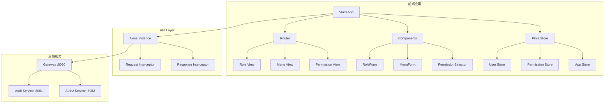
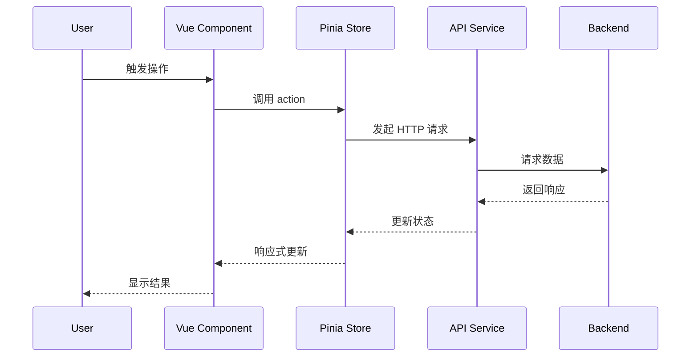

# Design Document

## Overview

本文档描述了一个基于 Vue3 + TypeScript + Element Plus 的工业级菜单角色管理前端系统的设计。该系统采用现代化的前端架构，包括组件化设计、状态管理、路由管理和 API 集成。系统将提供直观的用户界面，用于管理后端 RBAC 权限系统中的角色、菜单、权限及其关联关系。

### Technology Stack

- **框架**: Vue 3.4+ (Composition API)
- **语言**: TypeScript 5.0+
- **UI 组件库**: Element Plus 2.5+
- **状态管理**: Pinia 2.1+
- **路由**: Vue Router 4.2+
- **HTTP 客户端**: Axios 1.6+
- **构建工具**: Vite 5.0+
- **代码规范**: ESLint + Prettier
- **图标**: Element Plus Icons

### Design Principles

1. **组件化**: 高度模块化的组件设计，提高代码复用性
2. **类型安全**: 全面使用 TypeScript，确保类型安全
3. **响应式**: 适配不同屏幕尺寸，提供良好的移动端体验
4. **性能优化**: 懒加载、虚拟滚动、防抖节流等优化手段
5. **用户体验**: 流畅的交互动画、即时反馈、友好的错误提示
6. **可维护性**: 清晰的代码结构、完善的注释、统一的编码规范

## Architecture

### Project Structure

```
frontend/
├── public/                      # 静态资源
│   └── favicon.ico
├── src/
│   ├── api/                     # API 接口定义
│   │   ├── role.ts             # 角色相关 API
│   │   ├── menu.ts             # 菜单相关 API
│   │   ├── permission.ts       # 权限相关 API
│   │   └── user.ts             # 用户相关 API
│   ├── assets/                  # 资源文件
│   │   ├── styles/             # 全局样式
│   │   │   ├── index.scss      # 主样式文件
│   │   │   ├── variables.scss  # 样式变量
│   │   │   └── mixins.scss     # 样式混入
│   │   └── images/             # 图片资源
│   ├── components/              # 公共组件
│   │   ├── common/             # 通用组件
│   │   │   ├── PageHeader.vue  # 页面头部
│   │   │   ├── SearchBar.vue   # 搜索栏
│   │   │   └── EmptyState.vue  # 空状态
│   │   └── business/           # 业务组件
│   │       ├── RoleForm.vue    # 角色表单
│   │       ├── MenuForm.vue    # 菜单表单
│   │       └── PermissionSelector.vue # 权限选择器
│   ├── composables/             # 组合式函数
│   │   ├── useTable.ts         # 表格逻辑
│   │   ├── useDialog.ts        # 对话框逻辑
│   │   └── usePermission.ts    # 权限检查
│   ├── router/                  # 路由配置
│   │   └── index.ts
│   ├── stores/                  # 状态管理
│   │   ├── user.ts             # 用户状态
│   │   ├── permission.ts       # 权限状态
│   │   └── app.ts              # 应用状态
│   ├── types/                   # 类型定义
│   │   ├── role.ts             # 角色类型
│   │   ├── menu.ts             # 菜单类型
│   │   ├── permission.ts       # 权限类型
│   │   └── common.ts           # 通用类型
│   ├── utils/                   # 工具函数
│   │   ├── request.ts          # HTTP 请求封装
│   │   ├── auth.ts             # 认证工具
│   │   ├── storage.ts          # 本地存储
│   │   └── validate.ts         # 表单验证
│   ├── views/                   # 页面组件
│   │   ├── role/               # 角色管理
│   │   │   └── index.vue
│   │   ├── menu/               # 菜单管理
│   │   │   └── index.vue
│   │   ├── permission/         # 权限管理
│   │   │   └── index.vue
│   │   └── login/              # 登录页
│   │       └── index.vue
│   ├── App.vue                  # 根组件
│   └── main.ts                  # 入口文件
├── .env.development             # 开发环境变量
├── .env.production              # 生产环境变量
├── .eslintrc.js                 # ESLint 配置
├── .prettierrc.js               # Prettier 配置
├── tsconfig.json                # TypeScript 配置
├── vite.config.ts               # Vite 配置
└── package.json                 # 项目依赖
```


### System Architecture Diagram



### Data Flow



## Components and Interfaces

### Core Components

#### 1. RoleManagement (角色管理页面)

**路径**: `src/views/role/index.vue`

**功能**:
- 显示角色列表表格
- 提供新增、编辑、删除角色功能
- 提供角色权限分配功能
- 支持搜索和筛选

**Props**: 无

**Emits**: 无

**主要方法**:
```typescript
// 加载角色列表
const loadRoles = async () => Promise<void>

// 打开新增对话框
const handleAdd = () => void

// 打开编辑对话框
const handleEdit = (role: Role) => void

// 删除角色
const handleDelete = (roleId: number) => Promise<void>

// 打开权限分配对话框
const handleAssignPermissions = (role: Role) => void

// 保存角色
const handleSave = (roleData: RoleFormData) => Promise<void>
```


#### 2. MenuManagement (菜单管理页面)

**路径**: `src/views/menu/index.vue`

**功能**:
- 以树形表格显示菜单层级结构
- 提供新增、编辑、删除菜单功能
- 支持新增子菜单
- 提供菜单权限关联功能

**Props**: 无

**Emits**: 无

**主要方法**:
```typescript
// 加载菜单树
const loadMenuTree = async () => Promise<void>

// 打开新增顶级菜单对话框
const handleAddRoot = () => void

// 打开新增子菜单对话框
const handleAddChild = (parentMenu: Menu) => void

// 打开编辑对话框
const handleEdit = (menu: Menu) => void

// 删除菜单
const handleDelete = (menuId: number) => Promise<void>

// 打开权限关联对话框
const handleAssociatePermissions = (menu: Menu) => void
```

#### 3. PermissionManagement (权限管理页面)

**路径**: `src/views/permission/index.vue`

**功能**:
- 显示权限列表表格
- 提供新增、编辑、删除权限功能
- 支持按资源类型筛选
- 支持搜索功能

**Props**: 无

**Emits**: 无

**主要方法**:
```typescript
// 加载权限列表
const loadPermissions = async () => Promise<void>

// 打开新增对话框
const handleAdd = () => void

// 打开编辑对话框
const handleEdit = (permission: Permission) => void

// 删除权限
const handleDelete = (permissionId: number) => Promise<void>

// 按类型筛选
const handleFilterByType = (type: string) => void
```

#### 4. RoleForm (角色表单组件)

**路径**: `src/components/business/RoleForm.vue`

**功能**:
- 角色信息表单
- 表单验证
- 支持新增和编辑模式

**Props**:
```typescript
interface Props {
  modelValue: boolean        // 对话框显示状态
  roleData?: Role | null     // 角色数据（编辑模式）
  mode: 'add' | 'edit'       // 表单模式
}
```

**Emits**:
```typescript
interface Emits {
  (e: 'update:modelValue', value: boolean): void
  (e: 'submit', data: RoleFormData): void
}
```

**表单字段**:
```typescript
interface RoleFormData {
  roleName: string           // 角色名称
  roleKey: string            // 角色标识
  description: string        // 描述
  status: number             // 状态 (0-正常 1-禁用)
}
```

**验证规则**:
```typescript
const rules = {
  roleName: [
    { required: true, message: '请输入角色名称', trigger: 'blur' },
    { min: 2, max: 50, message: '长度在 2 到 50 个字符', trigger: 'blur' }
  ],
  roleKey: [
    { required: true, message: '请输入角色标识', trigger: 'blur' },
    { pattern: /^ROLE_[A-Z_]+$/, message: '格式为 ROLE_XXX', trigger: 'blur' }
  ],
  description: [
    { max: 200, message: '最多 200 个字符', trigger: 'blur' }
  ]
}
```


#### 5. MenuForm (菜单表单组件)

**路径**: `src/components/business/MenuForm.vue`

**功能**:
- 菜单信息表单
- 图标选择器
- 父菜单选择
- 表单验证

**Props**:
```typescript
interface Props {
  modelValue: boolean        // 对话框显示状态
  menuData?: Menu | null     // 菜单数据（编辑模式）
  parentId?: number          // 父菜单ID（新增子菜单时）
  mode: 'add' | 'edit'       // 表单模式
}
```

**Emits**:
```typescript
interface Emits {
  (e: 'update:modelValue', value: boolean): void
  (e: 'submit', data: MenuFormData): void
}
```

**表单字段**:
```typescript
interface MenuFormData {
  parentId: number           // 父菜单ID (0表示顶级)
  menuName: string           // 菜单名称
  menuPath: string           // 路由路径
  component: string          // 组件路径
  icon: string               // 图标
  sortOrder: number          // 排序号
  visible: number            // 是否可见 (0-显示 1-隐藏)
  status: number             // 状态 (0-正常 1-禁用)
}
```

**验证规则**:
```typescript
const rules = {
  menuName: [
    { required: true, message: '请输入菜单名称', trigger: 'blur' },
    { min: 2, max: 50, message: '长度在 2 到 50 个字符', trigger: 'blur' }
  ],
  menuPath: [
    { required: true, message: '请输入路由路径', trigger: 'blur' },
    { pattern: /^\/[a-z0-9/-]*$/, message: '格式为 /path', trigger: 'blur' }
  ],
  component: [
    { required: true, message: '请输入组件路径', trigger: 'blur' }
  ],
  sortOrder: [
    { required: true, message: '请输入排序号', trigger: 'blur' },
    { type: 'number', min: 0, message: '排序号不能小于0', trigger: 'blur' }
  ]
}
```

#### 6. PermissionSelector (权限选择器组件)

**路径**: `src/components/business/PermissionSelector.vue`

**功能**:
- 显示权限列表
- 支持多选
- 支持搜索和筛选
- 显示已选权限

**Props**:
```typescript
interface Props {
  modelValue: boolean        // 对话框显示状态
  selectedIds: number[]      // 已选权限ID列表
  title: string              // 对话框标题
}
```

**Emits**:
```typescript
interface Emits {
  (e: 'update:modelValue', value: boolean): void
  (e: 'confirm', ids: number[]): void
}
```

**主要方法**:
```typescript
// 加载权限列表
const loadPermissions = async () => Promise<void>

// 处理选择变化
const handleSelectionChange = (selection: Permission[]) => void

// 搜索权限
const handleSearch = (keyword: string) => void

// 按类型筛选
const handleFilterByType = (type: string) => void

// 确认选择
const handleConfirm = () => void
```


### Composables (组合式函数)

#### 1. useTable

**路径**: `src/composables/useTable.ts`

**功能**: 封装表格通用逻辑

```typescript
interface UseTableOptions<T> {
  fetchData: (params: any) => Promise<ApiResponse<T[]>>
  immediate?: boolean
}

interface UseTableReturn<T> {
  data: Ref<T[]>
  loading: Ref<boolean>
  total: Ref<number>
  currentPage: Ref<number>
  pageSize: Ref<number>
  loadData: () => Promise<void>
  handlePageChange: (page: number) => void
  handleSizeChange: (size: number) => void
  refresh: () => Promise<void>
}

export function useTable<T>(options: UseTableOptions<T>): UseTableReturn<T>
```

#### 2. useDialog

**路径**: `src/composables/useDialog.ts`

**功能**: 封装对话框通用逻辑

```typescript
interface UseDialogReturn {
  visible: Ref<boolean>
  loading: Ref<boolean>
  open: () => void
  close: () => void
  setLoading: (value: boolean) => void
}

export function useDialog(): UseDialogReturn
```

#### 3. usePermission

**路径**: `src/composables/usePermission.ts`

**功能**: 权限检查逻辑

```typescript
interface UsePermissionReturn {
  hasPermission: (permission: string) => boolean
  hasAnyPermission: (permissions: string[]) => boolean
  hasAllPermissions: (permissions: string[]) => boolean
}

export function usePermission(): UsePermissionReturn
```

## Data Models

### Type Definitions

#### Role (角色)

```typescript
interface Role {
  id: number
  roleName: string
  roleKey: string
  description: string
  status: number              // 0-正常 1-禁用
  createTime: string
}

interface RoleFormData {
  roleName: string
  roleKey: string
  description: string
  status: number
}
```

#### Menu (菜单)

```typescript
interface Menu {
  id: number
  parentId: number
  menuName: string
  menuPath: string
  component: string
  icon: string
  sortOrder: number
  visible: number             // 0-显示 1-隐藏
  status: number              // 0-正常 1-禁用
  children?: Menu[]
}

interface MenuFormData {
  parentId: number
  menuName: string
  menuPath: string
  component: string
  icon: string
  sortOrder: number
  visible: number
  status: number
}

interface MenuTreeNode {
  id: number
  parentId: number
  menuName: string
  menuPath: string
  component: string
  icon: string
  sortOrder: number
  children: MenuTreeNode[]
}
```

#### Permission (权限)

```typescript
interface Permission {
  id: number
  permissionName: string
  permissionKey: string
  resourceType: 'menu' | 'button' | 'api'
  resourcePath: string
  method: string              // GET, POST, PUT, DELETE
  description: string
}

interface PermissionFormData {
  permissionName: string
  permissionKey: string
  resourceType: 'menu' | 'button' | 'api'
  resourcePath: string
  method: string
  description: string
}
```

#### Common Types

```typescript
// API 响应格式
interface ApiResponse<T = any> {
  code: number
  message: string
  data: T
}

// 分页参数
interface PageParams {
  current: number
  size: number
}

// 分页响应
interface PageResponse<T> {
  records: T[]
  total: number
  size: number
  current: number
  pages: number
}

// 表格列配置
interface TableColumn {
  prop: string
  label: string
  width?: string | number
  minWidth?: string | number
  fixed?: boolean | 'left' | 'right'
  sortable?: boolean
  formatter?: (row: any, column: any, cellValue: any) => string
}
```


## API Services

### HTTP Client Configuration

**路径**: `src/utils/request.ts`

```typescript
import axios, { AxiosInstance, AxiosRequestConfig, AxiosResponse } from 'axios'
import { ElMessage } from 'element-plus'
import { useUserStore } from '@/stores/user'
import router from '@/router'

// 创建 axios 实例
const service: AxiosInstance = axios.create({
  baseURL: import.meta.env.VITE_API_BASE_URL || 'http://localhost:8080',
  timeout: 15000,
  headers: {
    'Content-Type': 'application/json'
  }
})

// 请求拦截器
service.interceptors.request.use(
  (config: AxiosRequestConfig) => {
    const userStore = useUserStore()
    const token = userStore.token
    
    if (token) {
      config.headers.Authorization = `Bearer ${token}`
    }
    
    return config
  },
  (error) => {
    console.error('Request error:', error)
    return Promise.reject(error)
  }
)

// 响应拦截器
service.interceptors.response.use(
  (response: AxiosResponse<ApiResponse>) => {
    const res = response.data
    
    // 检查是否有新 Token（自动刷新）
    const newToken = response.headers['authorization']
    if (newToken) {
      const userStore = useUserStore()
      userStore.setToken(newToken.replace('Bearer ', ''))
    }
    
    // 业务错误处理
    if (res.code !== 200) {
      ElMessage.error(res.message || '请求失败')
      return Promise.reject(new Error(res.message || '请求失败'))
    }
    
    return res
  },
  (error) => {
    console.error('Response error:', error)
    
    // 401 未授权
    if (error.response?.status === 401) {
      ElMessage.error('登录已过期，请重新登录')
      const userStore = useUserStore()
      userStore.logout()
      router.push('/login')
      return Promise.reject(error)
    }
    
    // 403 无权限
    if (error.response?.status === 403) {
      ElMessage.error('无权限访问该资源')
      return Promise.reject(error)
    }
    
    // 其他错误
    const message = error.response?.data?.message || error.message || '请求失败'
    ElMessage.error(message)
    return Promise.reject(error)
  }
)

export default service
```

### API Service Modules

#### Role API

**路径**: `src/api/role.ts`

```typescript
import request from '@/utils/request'
import type { Role, RoleFormData, ApiResponse } from '@/types'

// 获取所有角色
export function getRoles(): Promise<ApiResponse<Role[]>> {
  return request({
    url: '/api/roles',
    method: 'get'
  })
}

// 获取角色详情
export function getRoleById(id: number): Promise<ApiResponse<Role>> {
  return request({
    url: `/api/roles/${id}`,
    method: 'get'
  })
}

// 创建角色
export function createRole(data: RoleFormData): Promise<ApiResponse<Role>> {
  return request({
    url: '/api/roles',
    method: 'post',
    data
  })
}

// 更新角色
export function updateRole(id: number, data: RoleFormData): Promise<ApiResponse<Role>> {
  return request({
    url: `/api/roles/${id}`,
    method: 'put',
    data
  })
}

// 删除角色
export function deleteRole(id: number): Promise<ApiResponse<void>> {
  return request({
    url: `/api/roles/${id}`,
    method: 'delete'
  })
}

// 为角色分配权限
export function assignPermissionsToRole(
  roleId: number, 
  permissionIds: number[]
): Promise<ApiResponse<void>> {
  return request({
    url: `/api/roles/${roleId}/permissions`,
    method: 'post',
    data: permissionIds
  })
}

// 为用户分配角色
export function assignRolesToUser(
  userId: number, 
  roleIds: number[]
): Promise<ApiResponse<void>> {
  return request({
    url: `/api/roles/users/${userId}`,
    method: 'post',
    data: roleIds
  })
}

// 移除用户的角色
export function removeRoleFromUser(
  userId: number, 
  roleId: number
): Promise<ApiResponse<void>> {
  return request({
    url: `/api/roles/users/${userId}/roles/${roleId}`,
    method: 'delete'
  })
}
```


#### Menu API

**路径**: `src/api/menu.ts`

```typescript
import request from '@/utils/request'
import type { Menu, MenuFormData, MenuTreeNode, ApiResponse } from '@/types'

// 获取所有菜单
export function getMenus(): Promise<ApiResponse<Menu[]>> {
  return request({
    url: '/api/menus',
    method: 'get'
  })
}

// 获取菜单详情
export function getMenuById(id: number): Promise<ApiResponse<Menu>> {
  return request({
    url: `/api/menus/${id}`,
    method: 'get'
  })
}

// 获取用户菜单树
export function getUserMenuTree(userId: number): Promise<ApiResponse<MenuTreeNode[]>> {
  return request({
    url: `/api/menus/user/${userId}/tree`,
    method: 'get'
  })
}

// 创建菜单
export function createMenu(data: MenuFormData): Promise<ApiResponse<void>> {
  return request({
    url: '/api/menus',
    method: 'post',
    data
  })
}

// 更新菜单
export function updateMenu(id: number, data: MenuFormData): Promise<ApiResponse<void>> {
  return request({
    url: `/api/menus/${id}`,
    method: 'put',
    data
  })
}

// 删除菜单
export function deleteMenu(id: number): Promise<ApiResponse<void>> {
  return request({
    url: `/api/menus/${id}`,
    method: 'delete'
  })
}

// 关联菜单和权限
export function associateMenuPermission(
  menuId: number, 
  permissionId: number
): Promise<ApiResponse<void>> {
  return request({
    url: `/api/menus/${menuId}/permissions/${permissionId}`,
    method: 'post'
  })
}

// 取消菜单和权限的关联
export function disassociateMenuPermission(
  menuId: number, 
  permissionId: number
): Promise<ApiResponse<void>> {
  return request({
    url: `/api/menus/${menuId}/permissions/${permissionId}`,
    method: 'delete'
  })
}
```

#### Permission API

**路径**: `src/api/permission.ts`

```typescript
import request from '@/utils/request'
import type { Permission, PermissionFormData, ApiResponse } from '@/types'

// 获取所有权限
export function getPermissions(): Promise<ApiResponse<Permission[]>> {
  return request({
    url: '/api/permissions',
    method: 'get'
  })
}

// 获取权限详情
export function getPermissionById(id: number): Promise<ApiResponse<Permission>> {
  return request({
    url: `/api/permissions/${id}`,
    method: 'get'
  })
}

// 获取用户所有权限
export function getUserPermissions(userId: number): Promise<ApiResponse<Permission[]>> {
  return request({
    url: `/api/permissions/user/${userId}`,
    method: 'get'
  })
}

// 创建权限
export function createPermission(data: PermissionFormData): Promise<ApiResponse<Permission>> {
  return request({
    url: '/api/permissions',
    method: 'post',
    data
  })
}

// 更新权限
export function updatePermission(
  id: number, 
  data: PermissionFormData
): Promise<ApiResponse<Permission>> {
  return request({
    url: `/api/permissions/${id}`,
    method: 'put',
    data
  })
}

// 删除权限
export function deletePermission(id: number): Promise<ApiResponse<void>> {
  return request({
    url: `/api/permissions/${id}`,
    method: 'delete'
  })
}
```

## State Management (Pinia Stores)

### User Store

**路径**: `src/stores/user.ts`

```typescript
import { defineStore } from 'pinia'
import { ref, computed } from 'vue'
import { login, logout, getUserInfo } from '@/api/auth'
import { getToken, setToken, removeToken } from '@/utils/auth'
import type { LoginRequest, LoginResponse } from '@/types'

export const useUserStore = defineStore('user', () => {
  // State
  const token = ref<string>(getToken() || '')
  const userId = ref<number | null>(null)
  const username = ref<string>('')
  const nickname = ref<string>('')
  const roles = ref<string[]>([])
  const permissions = ref<string[]>([])
  
  // Getters
  const isLoggedIn = computed(() => !!token.value)
  const hasRole = computed(() => (role: string) => roles.value.includes(role))
  const hasPermission = computed(() => (permission: string) => 
    permissions.value.includes(permission)
  )
  
  // Actions
  async function loginAction(loginData: LoginRequest): Promise<void> {
    const response = await login(loginData)
    const data: LoginResponse = response.data
    
    token.value = data.token
    userId.value = data.userId
    username.value = data.username
    nickname.value = data.nickname
    roles.value = data.roles
    permissions.value = data.permissions
    
    setToken(data.token)
  }
  
  async function logoutAction(): Promise<void> {
    await logout()
    
    token.value = ''
    userId.value = null
    username.value = ''
    nickname.value = ''
    roles.value = []
    permissions.value = []
    
    removeToken()
  }
  
  function setTokenAction(newToken: string): void {
    token.value = newToken
    setToken(newToken)
  }
  
  return {
    token,
    userId,
    username,
    nickname,
    roles,
    permissions,
    isLoggedIn,
    hasRole,
    hasPermission,
    login: loginAction,
    logout: logoutAction,
    setToken: setTokenAction
  }
})
```


### Permission Store

**路径**: `src/stores/permission.ts`

```typescript
import { defineStore } from 'pinia'
import { ref } from 'vue'
import type { MenuTreeNode } from '@/types'

export const usePermissionStore = defineStore('permission', () => {
  // State
  const menuTree = ref<MenuTreeNode[]>([])
  const flatMenus = ref<MenuTreeNode[]>([])
  
  // Actions
  function setMenuTree(tree: MenuTreeNode[]): void {
    menuTree.value = tree
    flatMenus.value = flattenMenuTree(tree)
  }
  
  function flattenMenuTree(tree: MenuTreeNode[]): MenuTreeNode[] {
    const result: MenuTreeNode[] = []
    
    function traverse(nodes: MenuTreeNode[]) {
      nodes.forEach(node => {
        result.push(node)
        if (node.children && node.children.length > 0) {
          traverse(node.children)
        }
      })
    }
    
    traverse(tree)
    return result
  }
  
  function clearMenuTree(): void {
    menuTree.value = []
    flatMenus.value = []
  }
  
  return {
    menuTree,
    flatMenus,
    setMenuTree,
    clearMenuTree
  }
})
```

### App Store

**路径**: `src/stores/app.ts`

```typescript
import { defineStore } from 'pinia'
import { ref } from 'vue'

export const useAppStore = defineStore('app', () => {
  // State
  const sidebarCollapsed = ref<boolean>(false)
  const loading = ref<boolean>(false)
  
  // Actions
  function toggleSidebar(): void {
    sidebarCollapsed.value = !sidebarCollapsed.value
  }
  
  function setLoading(value: boolean): void {
    loading.value = value
  }
  
  return {
    sidebarCollapsed,
    loading,
    toggleSidebar,
    setLoading
  }
})
```

## Router Configuration

**路径**: `src/router/index.ts`

```typescript
import { createRouter, createWebHistory, RouteRecordRaw } from 'vue-router'
import { useUserStore } from '@/stores/user'
import { ElMessage } from 'element-plus'

const routes: RouteRecordRaw[] = [
  {
    path: '/login',
    name: 'Login',
    component: () => import('@/views/login/index.vue'),
    meta: { title: '登录', requiresAuth: false }
  },
  {
    path: '/',
    redirect: '/dashboard',
    component: () => import('@/layout/index.vue'),
    meta: { requiresAuth: true },
    children: [
      {
        path: 'dashboard',
        name: 'Dashboard',
        component: () => import('@/views/dashboard/index.vue'),
        meta: { title: '首页', icon: 'home' }
      },
      {
        path: 'role',
        name: 'RoleManagement',
        component: () => import('@/views/role/index.vue'),
        meta: { 
          title: '角色管理', 
          icon: 'user',
          permission: 'system:role:view'
        }
      },
      {
        path: 'menu',
        name: 'MenuManagement',
        component: () => import('@/views/menu/index.vue'),
        meta: { 
          title: '菜单管理', 
          icon: 'menu',
          permission: 'system:menu:view'
        }
      },
      {
        path: 'permission',
        name: 'PermissionManagement',
        component: () => import('@/views/permission/index.vue'),
        meta: { 
          title: '权限管理', 
          icon: 'lock',
          permission: 'system:permission:view'
        }
      }
    ]
  },
  {
    path: '/:pathMatch(.*)*',
    name: 'NotFound',
    component: () => import('@/views/error/404.vue'),
    meta: { title: '404' }
  }
]

const router = createRouter({
  history: createWebHistory(import.meta.env.BASE_URL),
  routes
})

// 路由守卫
router.beforeEach((to, from, next) => {
  const userStore = useUserStore()
  
  // 设置页面标题
  document.title = `${to.meta.title || ''} - 管理系统`
  
  // 检查是否需要登录
  if (to.meta.requiresAuth && !userStore.isLoggedIn) {
    ElMessage.warning('请先登录')
    next({ path: '/login', query: { redirect: to.fullPath } })
    return
  }
  
  // 检查权限
  if (to.meta.permission && !userStore.hasPermission(to.meta.permission as string)) {
    ElMessage.error('无权限访问该页面')
    next({ path: '/403' })
    return
  }
  
  next()
})

export default router
```


## Correctness Properties

*A property is a characteristic or behavior that should hold true across all valid executions of a system—essentially, a formal statement about what the system should do. Properties serve as the bridge between human-readable specifications and machine-verifiable correctness guarantees.*

### Property 1: API Integration Consistency

*For any* data loading operation (roles, menus, permissions), when the component mounts or refresh is triggered, the system should call the corresponding Backend API endpoint with correct parameters.

**Validates: Requirements 1.2, 5.2, 11.1**

### Property 2: Form Submission API Calls

*For any* valid form data (role, menu, permission), when the user submits the form, the system should call the appropriate Backend API endpoint (POST for create, PUT for update) with the form data.

**Validates: Requirements 2.3, 3.2, 6.4, 15.5**

### Property 3: Delete Confirmation Flow

*For any* entity (role, menu, permission), when the user confirms deletion, the system should call the DELETE API endpoint with the correct entity ID.

**Validates: Requirements 4.2**

### Property 4: Form Validation

*For any* form with required fields, when the user attempts to submit without filling all required fields, the system should display validation error messages and prevent submission.

**Validates: Requirements 2.6**

### Property 5: Success Feedback

*For any* successful API operation (create, update, delete), the system should display a success message, close any open dialogs, and refresh the data list.

**Validates: Requirements 2.4**

### Property 6: Tree Structure Rendering

*For any* menu item with children, the system should display expand/collapse icons and render child menus in a nested structure.

**Validates: Requirements 5.4**

### Property 7: Circular Reference Prevention

*For any* menu update operation, the system should prevent setting a menu's parent to be itself or any of its descendants.

**Validates: Requirements 7.4**

### Property 8: Loading State Management

*For any* form submission, the system should display a loading indicator during the API call and disable the submit button to prevent duplicate submissions.

**Validates: Requirements 10.3**

### Property 9: Token Persistence

*For any* successful login, the system should store the JWT token in local storage and include it in all subsequent API requests.

**Validates: Requirements 11.2**

### Property 10: Token Expiration Handling

*For any* API request that returns a 401 status code, the system should clear the stored token and redirect to the login page.

**Validates: Requirements 11.3**

### Property 11: Permission-Based UI Rendering

*For any* user without a specific permission, the system should hide UI elements (menus, buttons, pages) that require that permission.

**Validates: Requirements 12.2**

### Property 12: Permission Assignment API Call

*For any* role, when the user saves permission assignments, the system should call the POST /api/roles/{roleId}/permissions endpoint with the selected permission IDs.

**Validates: Requirements 9.5**


## Error Handling

### Error Types and Handling Strategies

#### 1. Network Errors

**Scenarios**:
- Network timeout
- Connection refused
- DNS resolution failure

**Handling**:
```typescript
// 在 axios 响应拦截器中统一处理
if (error.code === 'ECONNABORTED') {
  ElMessage.error('请求超时，请检查网络连接')
} else if (error.code === 'ERR_NETWORK') {
  ElMessage.error('网络连接失败，请检查网络设置')
}
```

#### 2. HTTP Status Errors

**401 Unauthorized**:
- 清除本地 Token
- 跳转到登录页
- 显示"登录已过期"提示

**403 Forbidden**:
- 显示"无权限访问"提示
- 保持在当前页面或返回上一页

**404 Not Found**:
- 显示"资源不存在"提示
- 提供返回按钮

**500 Internal Server Error**:
- 显示"服务器错误"提示
- 提供重试按钮

#### 3. Business Logic Errors

**Validation Errors**:
- 在表单字段下显示具体错误信息
- 高亮错误字段
- 阻止表单提交

**Duplicate Errors**:
- 显示"角色标识已存在"等具体提示
- 允许用户修改后重试

**Dependency Errors**:
- 显示"该菜单包含子菜单，请先删除子菜单"
- 提供查看依赖项的链接

#### 4. Client-Side Errors

**Form Validation**:
```typescript
const validateForm = async (formRef: FormInstance | undefined) => {
  if (!formRef) return false
  
  try {
    await formRef.validate()
    return true
  } catch (error) {
    ElMessage.warning('请检查表单填写是否正确')
    return false
  }
}
```

**Data Parsing Errors**:
```typescript
try {
  const data = JSON.parse(response)
} catch (error) {
  console.error('数据解析失败:', error)
  ElMessage.error('数据格式错误')
}
```

### Error Logging

```typescript
// 全局错误处理
app.config.errorHandler = (err, instance, info) => {
  console.error('Global error:', err)
  console.error('Component:', instance)
  console.error('Error info:', info)
  
  // 可以发送到日志服务
  // logService.error({ err, instance, info })
}
```

## Testing Strategy

### Unit Testing

**Framework**: Vitest + Vue Test Utils

**Coverage**:
- 组件渲染测试
- 用户交互测试
- 表单验证测试
- API 调用测试（使用 Mock）

**Example**:
```typescript
import { describe, it, expect, vi } from 'vitest'
import { mount } from '@vue/test-utils'
import RoleForm from '@/components/business/RoleForm.vue'

describe('RoleForm', () => {
  it('should render form fields correctly', () => {
    const wrapper = mount(RoleForm, {
      props: {
        modelValue: true,
        mode: 'add'
      }
    })
    
    expect(wrapper.find('input[name="roleName"]').exists()).toBe(true)
    expect(wrapper.find('input[name="roleKey"]').exists()).toBe(true)
  })
  
  it('should validate required fields', async () => {
    const wrapper = mount(RoleForm, {
      props: {
        modelValue: true,
        mode: 'add'
      }
    })
    
    await wrapper.find('form').trigger('submit')
    
    expect(wrapper.text()).toContain('请输入角色名称')
  })
  
  it('should emit submit event with form data', async () => {
    const wrapper = mount(RoleForm, {
      props: {
        modelValue: true,
        mode: 'add'
      }
    })
    
    await wrapper.find('input[name="roleName"]').setValue('测试角色')
    await wrapper.find('input[name="roleKey"]').setValue('ROLE_TEST')
    await wrapper.find('form').trigger('submit')
    
    expect(wrapper.emitted('submit')).toBeTruthy()
    expect(wrapper.emitted('submit')[0][0]).toEqual({
      roleName: '测试角色',
      roleKey: 'ROLE_TEST',
      description: '',
      status: 0
    })
  })
})
```

### Integration Testing

**Framework**: Cypress / Playwright

**Coverage**:
- 完整的用户流程测试
- 跨组件交互测试
- API 集成测试

**Example**:
```typescript
describe('Role Management', () => {
  beforeEach(() => {
    cy.login('admin', 'admin123')
    cy.visit('/role')
  })
  
  it('should create a new role', () => {
    cy.get('[data-test="add-role-btn"]').click()
    cy.get('[data-test="role-name-input"]').type('测试角色')
    cy.get('[data-test="role-key-input"]').type('ROLE_TEST')
    cy.get('[data-test="submit-btn"]').click()
    
    cy.contains('创建成功').should('be.visible')
    cy.contains('测试角色').should('be.visible')
  })
  
  it('should edit an existing role', () => {
    cy.get('[data-test="edit-role-btn"]').first().click()
    cy.get('[data-test="role-name-input"]').clear().type('更新后的角色')
    cy.get('[data-test="submit-btn"]').click()
    
    cy.contains('更新成功').should('be.visible')
    cy.contains('更新后的角色').should('be.visible')
  })
})
```

### Property-Based Testing

**Framework**: fast-check

**Configuration**: Minimum 100 iterations per property test

**Coverage**: Test universal properties across all inputs

**Example**:
```typescript
import { describe, it } from 'vitest'
import fc from 'fast-check'
import { validateRoleKey } from '@/utils/validate'

describe('Property Tests', () => {
  it('Property 4: Form validation should reject invalid inputs', () => {
    fc.assert(
      fc.property(
        fc.string().filter(s => !/^ROLE_[A-Z_]+$/.test(s)),
        (invalidKey) => {
          const result = validateRoleKey(invalidKey)
          return result === false
        }
      ),
      { numRuns: 100 }
    )
  })
  
  it('Property 7: Circular reference prevention', () => {
    fc.assert(
      fc.property(
        fc.nat(),
        fc.array(fc.nat()),
        (menuId, ancestorIds) => {
          const canSetParent = !ancestorIds.includes(menuId)
          return canSetParent === isValidParentSelection(menuId, ancestorIds)
        }
      ),
      { numRuns: 100 }
    )
  })
})
```

### E2E Testing

**Framework**: Playwright

**Coverage**:
- 完整的业务流程
- 跨浏览器兼容性测试
- 响应式布局测试

**Example**:
```typescript
import { test, expect } from '@playwright/test'

test('complete role management workflow', async ({ page }) => {
  // 登录
  await page.goto('/login')
  await page.fill('[name="username"]', 'admin')
  await page.fill('[name="password"]', 'admin123')
  await page.click('[type="submit"]')
  
  // 导航到角色管理
  await page.click('text=角色管理')
  await expect(page).toHaveURL('/role')
  
  // 创建角色
  await page.click('text=新增角色')
  await page.fill('[name="roleName"]', '测试角色')
  await page.fill('[name="roleKey"]', 'ROLE_TEST')
  await page.click('text=确定')
  
  // 验证创建成功
  await expect(page.locator('text=测试角色')).toBeVisible()
  
  // 分配权限
  await page.click('[data-test="assign-permissions-btn"]')
  await page.check('[data-permission-id="1"]')
  await page.check('[data-permission-id="2"]')
  await page.click('text=保存')
  
  // 验证权限分配成功
  await expect(page.locator('text=权限分配成功')).toBeVisible()
})
```


## UI/UX Design Guidelines

### Color Scheme (科技感 + 简约大气)

```scss
// Primary Colors - 科技蓝色系
$primary-color: #0066FF;        // 主色 - 科技蓝
$primary-light: #3385FF;        // 浅蓝
$primary-lighter: #66A3FF;      // 更浅蓝
$primary-dark: #0052CC;         // 深蓝
$primary-gradient: linear-gradient(135deg, #0066FF 0%, #00D4FF 100%); // 渐变

// Accent Colors - 点缀色
$accent-cyan: #00D4FF;          // 青色 - 科技感
$accent-purple: #6C5CE7;        // 紫色 - 高级感
$accent-green: #00E676;         // 绿色 - 成功
$accent-orange: #FF9500;        // 橙色 - 警告
$accent-red: #FF3B30;           // 红色 - 危险

// Neutral Colors - 深色系（简约大气）
$text-primary: #1A1A1A;         // 主要文字 - 深灰黑
$text-regular: #4A4A4A;         // 常规文字 - 中灰
$text-secondary: #8E8E93;       // 次要文字 - 浅灰
$text-placeholder: #C7C7CC;     // 占位文字 - 极浅灰
$text-inverse: #FFFFFF;         // 反色文字 - 白色

// Border Colors - 细腻边框
$border-base: #E5E5EA;          // 一级边框
$border-light: #EFEFF4;         // 二级边框
$border-lighter: #F7F7F8;       // 三级边框
$border-glow: rgba(0, 102, 255, 0.2); // 发光边框

// Background Colors - 层次分明
$bg-primary: #FFFFFF;           // 主背景 - 纯白
$bg-secondary: #F8F9FA;         // 次背景 - 浅灰
$bg-tertiary: #F2F3F5;          // 三级背景
$bg-dark: #1A1A1A;              // 深色背景
$bg-card: #FFFFFF;              // 卡片背景
$bg-hover: rgba(0, 102, 255, 0.04); // 悬停背景
$bg-overlay: rgba(0, 0, 0, 0.6); // 遮罩层
$bg-glass: rgba(255, 255, 255, 0.8); // 毛玻璃效果

// Shadow - 立体感阴影
$shadow-sm: 0 2px 8px rgba(0, 0, 0, 0.04);
$shadow-md: 0 4px 16px rgba(0, 0, 0, 0.08);
$shadow-lg: 0 8px 24px rgba(0, 0, 0, 0.12);
$shadow-xl: 0 12px 32px rgba(0, 0, 0, 0.16);
$shadow-glow: 0 0 20px rgba(0, 102, 255, 0.3); // 发光阴影
```

### Typography (现代简约)

```scss
// Font Family - 现代无衬线字体
$font-family-base: 'Inter', -apple-system, BlinkMacSystemFont, 'Segoe UI', 
                   Roboto, 'Helvetica Neue', Arial, sans-serif;
$font-family-mono: 'JetBrains Mono', 'Fira Code', 'Consolas', monospace;

// Font Sizes - 清晰的层级
$font-size-h1: 32px;            // 大标题
$font-size-h2: 24px;            // 二级标题
$font-size-h3: 20px;            // 三级标题
$font-size-large: 18px;         // 大号文字
$font-size-medium: 16px;        // 中号文字
$font-size-base: 14px;          // 基础文字
$font-size-small: 13px;         // 小号文字
$font-size-mini: 12px;          // 迷你文字

// Font Weights - 精细控制
$font-weight-light: 300;
$font-weight-normal: 400;
$font-weight-medium: 500;
$font-weight-semibold: 600;
$font-weight-bold: 700;

// Line Heights - 舒适阅读
$line-height-tight: 1.2;
$line-height-base: 1.5;
$line-height-relaxed: 1.75;
$line-height-loose: 2;

// Letter Spacing - 精致间距
$letter-spacing-tight: -0.02em;
$letter-spacing-normal: 0;
$letter-spacing-wide: 0.02em;
```

### Spacing System

```scss
// Spacing Scale (基于 8px 网格系统)
$spacing-xs: 4px;
$spacing-sm: 8px;
$spacing-md: 16px;
$spacing-lg: 24px;
$spacing-xl: 32px;
$spacing-xxl: 48px;

// Component Spacing
$padding-page: $spacing-lg;
$padding-card: $spacing-md;
$padding-form: $spacing-md;
$margin-section: $spacing-xl;
```

### Layout Guidelines

#### Page Layout

```vue
<template>
  <div class="page-container">
    <!-- 页面头部 -->
    <div class="page-header">
      <h1 class="page-title">{{ title }}</h1>
      <div class="page-actions">
        <el-button type="primary" @click="handleAdd">
          <el-icon><Plus /></el-icon>
          新增
        </el-button>
      </div>
    </div>
    
    <!-- 搜索栏 -->
    <div class="search-bar">
      <el-form :inline="true">
        <el-form-item label="关键词">
          <el-input v-model="searchKeyword" placeholder="请输入关键词" />
        </el-form-item>
        <el-form-item>
          <el-button type="primary" @click="handleSearch">搜索</el-button>
          <el-button @click="handleReset">重置</el-button>
        </el-form-item>
      </el-form>
    </div>
    
    <!-- 数据表格 -->
    <div class="table-container">
      <el-table :data="tableData" v-loading="loading">
        <!-- 表格列 -->
      </el-table>
      
      <!-- 分页 -->
      <el-pagination
        v-model:current-page="currentPage"
        v-model:page-size="pageSize"
        :total="total"
        layout="total, sizes, prev, pager, next, jumper"
      />
    </div>
  </div>
</template>

<style scoped lang="scss">
.page-container {
  padding: $padding-page;
  background-color: $bg-page;
  min-height: 100vh;
}

.page-header {
  display: flex;
  justify-content: space-between;
  align-items: center;
  margin-bottom: $spacing-lg;
  padding: $spacing-md;
  background-color: $bg-color;
  border-radius: 4px;
  box-shadow: 0 2px 4px rgba(0, 0, 0, 0.1);
}

.page-title {
  font-size: $font-size-extra-large;
  font-weight: $font-weight-bold;
  color: $text-primary;
  margin: 0;
}

.search-bar {
  margin-bottom: $spacing-md;
  padding: $spacing-md;
  background-color: $bg-color;
  border-radius: 4px;
}

.table-container {
  padding: $spacing-md;
  background-color: $bg-color;
  border-radius: 4px;
}
</style>
```

#### Form Layout

```vue
<template>
  <el-dialog
    v-model="visible"
    :title="title"
    width="600px"
    :close-on-click-modal="false"
  >
    <el-form
      ref="formRef"
      :model="formData"
      :rules="rules"
      label-width="100px"
    >
      <el-form-item label="角色名称" prop="roleName">
        <el-input v-model="formData.roleName" placeholder="请输入角色名称" />
      </el-form-item>
      
      <el-form-item label="角色标识" prop="roleKey">
        <el-input v-model="formData.roleKey" placeholder="请输入角色标识" />
      </el-form-item>
      
      <el-form-item label="描述" prop="description">
        <el-input
          v-model="formData.description"
          type="textarea"
          :rows="3"
          placeholder="请输入描述"
        />
      </el-form-item>
      
      <el-form-item label="状态" prop="status">
        <el-radio-group v-model="formData.status">
          <el-radio :label="0">正常</el-radio>
          <el-radio :label="1">禁用</el-radio>
        </el-radio-group>
      </el-form-item>
    </el-form>
    
    <template #footer>
      <el-button @click="handleCancel">取消</el-button>
      <el-button type="primary" :loading="loading" @click="handleSubmit">
        确定
      </el-button>
    </template>
  </el-dialog>
</template>
```

### Interaction Patterns

#### Loading States

```typescript
// 全局加载
import { ElLoading } from 'element-plus'

const loading = ElLoading.service({
  lock: true,
  text: '加载中...',
  background: 'rgba(0, 0, 0, 0.7)'
})

// 操作完成后关闭
loading.close()

// 局部加载（表格）
<el-table v-loading="loading" :data="tableData">
  <!-- ... -->
</el-table>

// 按钮加载
<el-button :loading="submitting" @click="handleSubmit">
  提交
</el-button>
```

#### Feedback Messages

```typescript
import { ElMessage, ElMessageBox } from 'element-plus'

// 成功提示
ElMessage.success('操作成功')

// 错误提示
ElMessage.error('操作失败')

// 警告提示
ElMessage.warning('请先选择数据')

// 信息提示
ElMessage.info('暂无数据')

// 确认对话框
ElMessageBox.confirm('确定要删除该角色吗？', '提示', {
  confirmButtonText: '确定',
  cancelButtonText: '取消',
  type: 'warning'
}).then(() => {
  // 确认操作
}).catch(() => {
  // 取消操作
})
```

#### Animation and Transitions

```scss
// 淡入淡出
.fade-enter-active,
.fade-leave-active {
  transition: opacity 0.3s ease;
}

.fade-enter-from,
.fade-leave-to {
  opacity: 0;
}

// 滑动
.slide-enter-active,
.slide-leave-active {
  transition: transform 0.3s ease;
}

.slide-enter-from {
  transform: translateX(-100%);
}

.slide-leave-to {
  transform: translateX(100%);
}

// 缩放
.zoom-enter-active,
.zoom-leave-active {
  transition: transform 0.3s ease;
}

.zoom-enter-from,
.zoom-leave-to {
  transform: scale(0.9);
}
```

### Responsive Design

```scss
// Breakpoints
$breakpoint-xs: 480px;
$breakpoint-sm: 768px;
$breakpoint-md: 992px;
$breakpoint-lg: 1200px;
$breakpoint-xl: 1920px;

// Responsive Mixins
@mixin respond-to($breakpoint) {
  @if $breakpoint == 'xs' {
    @media (max-width: $breakpoint-xs) { @content; }
  }
  @else if $breakpoint == 'sm' {
    @media (max-width: $breakpoint-sm) { @content; }
  }
  @else if $breakpoint == 'md' {
    @media (max-width: $breakpoint-md) { @content; }
  }
  @else if $breakpoint == 'lg' {
    @media (max-width: $breakpoint-lg) { @content; }
  }
}

// Usage
.page-container {
  padding: $spacing-lg;
  
  @include respond-to('md') {
    padding: $spacing-md;
  }
  
  @include respond-to('sm') {
    padding: $spacing-sm;
  }
}

.table-container {
  overflow-x: auto;
  
  @include respond-to('md') {
    .el-table__column--hidden-sm {
      display: none;
    }
  }
}
```

### Accessibility

```vue
<template>
  <!-- 语义化 HTML -->
  <nav aria-label="主导航">
    <ul role="menubar">
      <li role="none">
        <a role="menuitem" href="/role">角色管理</a>
      </li>
    </ul>
  </nav>
  
  <!-- ARIA 标签 -->
  <button
    aria-label="新增角色"
    aria-describedby="add-role-description"
    @click="handleAdd"
  >
    <el-icon><Plus /></el-icon>
  </button>
  <span id="add-role-description" class="sr-only">
    点击此按钮打开新增角色对话框
  </span>
  
  <!-- 键盘导航 -->
  <el-table
    :data="tableData"
    @row-click="handleRowClick"
    @keydown.enter="handleRowEnter"
    tabindex="0"
  >
    <!-- ... -->
  </el-table>
  
  <!-- 焦点管理 -->
  <el-dialog
    v-model="visible"
    @opened="focusFirstInput"
  >
    <el-input ref="firstInputRef" />
  </el-dialog>
</template>

<script setup lang="ts">
const firstInputRef = ref()

const focusFirstInput = () => {
  nextTick(() => {
    firstInputRef.value?.focus()
  })
}
</script>

<style scoped>
/* 屏幕阅读器专用 */
.sr-only {
  position: absolute;
  width: 1px;
  height: 1px;
  padding: 0;
  margin: -1px;
  overflow: hidden;
  clip: rect(0, 0, 0, 0);
  white-space: nowrap;
  border-width: 0;
}
</style>
```

## Performance Optimization

### Code Splitting

```typescript
// 路由懒加载
const routes = [
  {
    path: '/role',
    component: () => import('@/views/role/index.vue')
  },
  {
    path: '/menu',
    component: () => import('@/views/menu/index.vue')
  }
]

// 组件懒加载
const RoleForm = defineAsyncComponent(() => 
  import('@/components/business/RoleForm.vue')
)
```

### Virtual Scrolling

```vue
<template>
  <!-- 大数据量表格使用虚拟滚动 -->
  <el-table-v2
    :columns="columns"
    :data="largeDataset"
    :width="700"
    :height="400"
    fixed
  />
</template>
```

### Debounce and Throttle

```typescript
import { debounce, throttle } from 'lodash-es'

// 搜索防抖
const handleSearch = debounce((keyword: string) => {
  // 执行搜索
}, 300)

// 滚动节流
const handleScroll = throttle(() => {
  // 处理滚动
}, 100)
```

### Caching Strategy

```typescript
// API 响应缓存
const cache = new Map()

export async function getRoles(): Promise<ApiResponse<Role[]>> {
  const cacheKey = 'roles'
  
  if (cache.has(cacheKey)) {
    return cache.get(cacheKey)
  }
  
  const response = await request({ url: '/api/roles', method: 'get' })
  cache.set(cacheKey, response)
  
  // 5分钟后清除缓存
  setTimeout(() => cache.delete(cacheKey), 5 * 60 * 1000)
  
  return response
}
```

### Image Optimization

```vue
<template>
  <!-- 懒加载图片 -->
  
  
  <!-- 响应式图片 -->
  <picture>
    <source
      media="(min-width: 1200px)"
      srcset="image-large.jpg"
    />
    <source
      media="(min-width: 768px)"
      srcset="image-medium.jpg"
    />
    
  </picture>
</template>
```

## Security Considerations

### XSS Prevention

```typescript
// 使用 Vue 的自动转义
<template>
  <!-- 安全：自动转义 -->
  <div>{{ userInput }}</div>
  
  <!-- 危险：不要使用 v-html 显示用户输入 -->
  <div v-html="userInput"></div> <!-- ❌ -->
  
  <!-- 如果必须使用 v-html，先进行清理 -->
  <div v-html="sanitize(userInput)"></div> <!-- ✅ -->
</template>

<script setup lang="ts">
import DOMPurify from 'dompurify'

const sanitize = (html: string) => {
  return DOMPurify.sanitize(html)
}
</script>
```

### CSRF Protection

```typescript
// Axios 自动处理 CSRF Token
axios.defaults.xsrfCookieName = 'csrftoken'
axios.defaults.xsrfHeaderName = 'X-CSRFToken'
```

### Secure Storage

```typescript
// 敏感信息加密存储
import CryptoJS from 'crypto-js'

const SECRET_KEY = import.meta.env.VITE_STORAGE_SECRET

export function setSecureItem(key: string, value: string): void {
  const encrypted = CryptoJS.AES.encrypt(value, SECRET_KEY).toString()
  localStorage.setItem(key, encrypted)
}

export function getSecureItem(key: string): string | null {
  const encrypted = localStorage.getItem(key)
  if (!encrypted) return null
  
  const decrypted = CryptoJS.AES.decrypt(encrypted, SECRET_KEY)
  return decrypted.toString(CryptoJS.enc.Utf8)
}
```

### Input Validation

```typescript
// 前端验证（不能替代后端验证）
export function validateRoleKey(value: string): boolean {
  // 只允许 ROLE_ 开头的大写字母和下划线
  return /^ROLE_[A-Z_]+$/.test(value)
}

export function validateMenuPath(value: string): boolean {
  // 只允许小写字母、数字、斜杠和连字符
  return /^\/[a-z0-9/-]*$/.test(value)
}

export function sanitizeInput(value: string): string {
  // 移除潜在危险字符
  return value.replace(/[<>\"']/g, '')
}
```

## Deployment

### Build Configuration

```typescript
// vite.config.ts
import { defineConfig } from 'vite'
import vue from '@vitejs/plugin-vue'
import { resolve } from 'path'

export default defineConfig({
  plugins: [vue()],
  resolve: {
    alias: {
      '@': resolve(__dirname, 'src')
    }
  },
  build: {
    target: 'es2015',
    outDir: 'dist',
    assetsDir: 'assets',
    sourcemap: false,
    minify: 'terser',
    terserOptions: {
      compress: {
        drop_console: true,
        drop_debugger: true
      }
    },
    rollupOptions: {
      output: {
        manualChunks: {
          'element-plus': ['element-plus'],
          'vue-vendor': ['vue', 'vue-router', 'pinia']
        }
      }
    }
  }
})
```

### Environment Variables

```bash
# .env.development
VITE_API_BASE_URL=http://localhost:8080
VITE_APP_TITLE=管理系统（开发环境）

# .env.production
VITE_API_BASE_URL=https://api.example.com
VITE_APP_TITLE=管理系统
```

### Docker Deployment

```dockerfile
# Dockerfile
FROM node:18-alpine as build-stage

WORKDIR /app
COPY package*.json ./
RUN npm ci
COPY . .
RUN npm run build

FROM nginx:alpine as production-stage
COPY --from=build-stage /app/dist /usr/share/nginx/html
COPY nginx.conf /etc/nginx/nginx.conf
EXPOSE 80
CMD ["nginx", "-g", "daemon off;"]
```

```nginx
# nginx.conf
server {
    listen 80;
    server_name localhost;
    root /usr/share/nginx/html;
    index index.html;

    location / {
        try_files $uri $uri/ /index.html;
    }

    location /api {
        proxy_pass http://backend:8080;
        proxy_set_header Host $host;
        proxy_set_header X-Real-IP $remote_addr;
    }
}
```


### 科技感设计元素

#### 1. 毛玻璃效果 (Glassmorphism)

```scss
.glass-card {
  background: rgba(255, 255, 255, 0.8);
  backdrop-filter: blur(20px) saturate(180%);
  -webkit-backdrop-filter: blur(20px) saturate(180%);
  border: 1px solid rgba(255, 255, 255, 0.3);
  border-radius: 16px;
  box-shadow: $shadow-lg;
}

.glass-dark {
  background: rgba(26, 26, 26, 0.8);
  backdrop-filter: blur(20px) saturate(180%);
  border: 1px solid rgba(255, 255, 255, 0.1);
}
```

#### 2. 发光效果 (Glow Effects)

```scss
.glow-button {
  position: relative;
  background: $primary-gradient;
  border: none;
  border-radius: 8px;
  color: $text-inverse;
  padding: 12px 24px;
  font-weight: $font-weight-medium;
  cursor: pointer;
  transition: all 0.3s ease;
  
  &::before {
    content: '';
    position: absolute;
    inset: -2px;
    background: $primary-gradient;
    border-radius: 10px;
    opacity: 0;
    filter: blur(10px);
    transition: opacity 0.3s ease;
    z-index: -1;
  }
  
  &:hover::before {
    opacity: 0.7;
  }
  
  &:hover {
    transform: translateY(-2px);
    box-shadow: $shadow-glow;
  }
}

.glow-border {
  position: relative;
  border: 1px solid transparent;
  background: linear-gradient($bg-primary, $bg-primary) padding-box,
              $primary-gradient border-box;
  border-radius: 12px;
}
```

#### 3. 渐变背景 (Gradient Backgrounds)

```scss
.gradient-bg {
  background: linear-gradient(135deg, 
    rgba(0, 102, 255, 0.05) 0%, 
    rgba(0, 212, 255, 0.05) 100%
  );
}

.gradient-text {
  background: $primary-gradient;
  -webkit-background-clip: text;
  -webkit-text-fill-color: transparent;
  background-clip: text;
  font-weight: $font-weight-bold;
}

.animated-gradient {
  background: linear-gradient(
    -45deg,
    #0066FF,
    #00D4FF,
    #6C5CE7,
    #0066FF
  );
  background-size: 400% 400%;
  animation: gradient-shift 15s ease infinite;
}

@keyframes gradient-shift {
  0% { background-position: 0% 50%; }
  50% { background-position: 100% 50%; }
  100% { background-position: 0% 50%; }
}
```

#### 4. 悬浮卡片 (Floating Cards)

```scss
.floating-card {
  background: $bg-card;
  border-radius: 16px;
  padding: $spacing-lg;
  box-shadow: $shadow-md;
  transition: all 0.3s cubic-bezier(0.4, 0, 0.2, 1);
  
  &:hover {
    transform: translateY(-4px);
    box-shadow: $shadow-xl;
  }
}

.tech-card {
  position: relative;
  background: $bg-card;
  border: 1px solid $border-light;
  border-radius: 12px;
  overflow: hidden;
  
  &::before {
    content: '';
    position: absolute;
    top: 0;
    left: -100%;
    width: 100%;
    height: 2px;
    background: $primary-gradient;
    transition: left 0.5s ease;
  }
  
  &:hover::before {
    left: 100%;
  }
}
```

#### 5. 数据可视化元素

```scss
.data-badge {
  display: inline-flex;
  align-items: center;
  gap: 8px;
  padding: 6px 12px;
  background: rgba(0, 102, 255, 0.1);
  border: 1px solid rgba(0, 102, 255, 0.2);
  border-radius: 20px;
  color: $primary-color;
  font-size: $font-size-small;
  font-weight: $font-weight-medium;
  
  .badge-dot {
    width: 6px;
    height: 6px;
    border-radius: 50%;
    background: $primary-color;
    animation: pulse 2s ease-in-out infinite;
  }
}

@keyframes pulse {
  0%, 100% {
    opacity: 1;
    transform: scale(1);
  }
  50% {
    opacity: 0.5;
    transform: scale(1.2);
  }
}

.progress-ring {
  position: relative;
  width: 120px;
  height: 120px;
  
  svg {
    transform: rotate(-90deg);
    
    circle {
      fill: none;
      stroke-width: 8;
      stroke-linecap: round;
      
      &.bg {
        stroke: $border-light;
      }
      
      &.progress {
        stroke: url(#gradient);
        stroke-dasharray: 283;
        stroke-dashoffset: 283;
        animation: progress 2s ease-out forwards;
      }
    }
  }
}

@keyframes progress {
  to {
    stroke-dashoffset: 0;
  }
}
```

#### 6. 微交互动画

```scss
.interactive-icon {
  display: inline-flex;
  align-items: center;
  justify-content: center;
  width: 40px;
  height: 40px;
  border-radius: 10px;
  background: $bg-hover;
  color: $primary-color;
  cursor: pointer;
  transition: all 0.2s ease;
  
  &:hover {
    background: rgba(0, 102, 255, 0.1);
    transform: scale(1.1);
  }
  
  &:active {
    transform: scale(0.95);
  }
}

.ripple-effect {
  position: relative;
  overflow: hidden;
  
  &::after {
    content: '';
    position: absolute;
    top: 50%;
    left: 50%;
    width: 0;
    height: 0;
    border-radius: 50%;
    background: rgba(0, 102, 255, 0.3);
    transform: translate(-50%, -50%);
    transition: width 0.6s, height 0.6s;
  }
  
  &:active::after {
    width: 300px;
    height: 300px;
  }
}
```

### 简约大气的页面布局

#### 1. 顶部导航栏 (科技感)

```vue
<template>
  <header class="tech-header">
    <div class="header-container">
      <!-- Logo 区域 -->
      <div class="logo-section">
        <div class="logo-icon">
          <div class="logo-glow"></div>
          <svg viewBox="0 0 40 40">
            <!-- Logo SVG -->
          </svg>
        </div>
        <span class="logo-text gradient-text">管理系统</span>
      </div>
      
      <!-- 导航菜单 -->
      <nav class="nav-menu">
        <a
          v-for="item in menuItems"
          :key="item.path"
          :href="item.path"
          class="nav-item"
          :class="{ active: isActive(item.path) }"
        >
          <span class="nav-icon">{{ item.icon }}</span>
          <span class="nav-label">{{ item.label }}</span>
          <div class="nav-indicator"></div>
        </a>
      </nav>
      
      <!-- 用户区域 -->
      <div class="user-section">
        <div class="notification-btn">
          <el-icon><Bell /></el-icon>
          <span class="badge">3</span>
        </div>
        
        <el-dropdown class="user-dropdown">
          <div class="user-avatar">
            
            <div class="status-dot"></div>
          </div>
          <template #dropdown>
            <el-dropdown-menu class="glass-dropdown">
              <el-dropdown-item>个人中心</el-dropdown-item>
              <el-dropdown-item>设置</el-dropdown-item>
              <el-dropdown-item divided @click="handleLogout">
                退出登录
              </el-dropdown-item>
            </el-dropdown-menu>
          </template>
        </el-dropdown>
      </div>
    </div>
  </header>
</template>

<style scoped lang="scss">
.tech-header {
  position: sticky;
  top: 0;
  z-index: 1000;
  background: rgba(255, 255, 255, 0.8);
  backdrop-filter: blur(20px) saturate(180%);
  border-bottom: 1px solid $border-light;
  box-shadow: $shadow-sm;
}

.header-container {
  display: flex;
  align-items: center;
  justify-content: space-between;
  max-width: 1920px;
  margin: 0 auto;
  padding: 0 $spacing-xl;
  height: 64px;
}

.logo-section {
  display: flex;
  align-items: center;
  gap: $spacing-md;
}

.logo-icon {
  position: relative;
  width: 40px;
  height: 40px;
  
  .logo-glow {
    position: absolute;
    inset: -4px;
    background: $primary-gradient;
    border-radius: 50%;
    filter: blur(8px);
    opacity: 0.3;
    animation: pulse 3s ease-in-out infinite;
  }
  
  svg {
    position: relative;
    width: 100%;
    height: 100%;
  }
}

.logo-text {
  font-size: $font-size-h3;
  font-weight: $font-weight-bold;
  letter-spacing: $letter-spacing-tight;
}

.nav-menu {
  display: flex;
  gap: $spacing-sm;
}

.nav-item {
  position: relative;
  display: flex;
  align-items: center;
  gap: 8px;
  padding: 10px 16px;
  border-radius: 10px;
  color: $text-regular;
  text-decoration: none;
  font-size: $font-size-base;
  font-weight: $font-weight-medium;
  transition: all 0.2s ease;
  
  &:hover {
    background: $bg-hover;
    color: $primary-color;
  }
  
  &.active {
    color: $primary-color;
    
    .nav-indicator {
      width: 100%;
    }
  }
  
  .nav-indicator {
    position: absolute;
    bottom: 0;
    left: 0;
    width: 0;
    height: 2px;
    background: $primary-gradient;
    border-radius: 2px 2px 0 0;
    transition: width 0.3s ease;
  }
}

.user-section {
  display: flex;
  align-items: center;
  gap: $spacing-md;
}

.notification-btn {
  position: relative;
  display: flex;
  align-items: center;
  justify-content: center;
  width: 40px;
  height: 40px;
  border-radius: 10px;
  background: $bg-hover;
  color: $text-regular;
  cursor: pointer;
  transition: all 0.2s ease;
  
  &:hover {
    background: rgba(0, 102, 255, 0.1);
    color: $primary-color;
  }
  
  .badge {
    position: absolute;
    top: 8px;
    right: 8px;
    display: flex;
    align-items: center;
    justify-content: center;
    min-width: 18px;
    height: 18px;
    padding: 0 4px;
    background: $accent-red;
    border: 2px solid $bg-primary;
    border-radius: 9px;
    color: $text-inverse;
    font-size: 11px;
    font-weight: $font-weight-semibold;
  }
}

.user-avatar {
  position: relative;
  width: 40px;
  height: 40px;
  border-radius: 50%;
  overflow: hidden;
  cursor: pointer;
  border: 2px solid $border-glow;
  transition: all 0.2s ease;
  
  &:hover {
    border-color: $primary-color;
    transform: scale(1.05);
  }
  
  img {
    width: 100%;
    height: 100%;
    object-fit: cover;
  }
  
  .status-dot {
    position: absolute;
    bottom: 2px;
    right: 2px;
    width: 10px;
    height: 10px;
    background: $accent-green;
    border: 2px solid $bg-primary;
    border-radius: 50%;
  }
}
</style>
```

#### 2. 数据表格 (现代简约)

```vue
<template>
  <div class="modern-table-container">
    <!-- 表格头部操作栏 -->
    <div class="table-toolbar">
      <div class="toolbar-left">
        <h2 class="table-title">角色列表</h2>
        <div class="data-badge">
          <span class="badge-dot"></span>
          <span>共 {{ total }} 条数据</span>
        </div>
      </div>
      
      <div class="toolbar-right">
        <el-input
          v-model="searchKeyword"
          placeholder="搜索角色..."
          prefix-icon="Search"
          class="search-input"
          clearable
        />
        <button class="glow-button" @click="handleAdd">
          <el-icon><Plus /></el-icon>
          <span>新增角色</span>
        </button>
      </div>
    </div>
    
    <!-- 数据表格 -->
    <div class="table-wrapper">
      <el-table
        :data="tableData"
        v-loading="loading"
        class="tech-table"
        :header-cell-style="headerCellStyle"
        :cell-style="cellStyle"
      >
        <el-table-column type="selection" width="55" />
        
        <el-table-column prop="id" label="ID" width="80">
          <template #default="{ row }">
            <span class="id-badge">#{{ row.id }}</span>
          </template>
        </el-table-column>
        
        <el-table-column prop="roleName" label="角色名称" min-width="150">
          <template #default="{ row }">
            <div class="role-name-cell">
              <div class="role-icon">{{ row.icon }}</div>
              <span>{{ row.roleName }}</span>
            </div>
          </template>
        </el-table-column>
        
        <el-table-column prop="roleKey" label="角色标识" min-width="150">
          <template #default="{ row }">
            <code class="code-badge">{{ row.roleKey }}</code>
          </template>
        </el-table-column>
        
        <el-table-column prop="description" label="描述" min-width="200" />
        
        <el-table-column prop="status" label="状态" width="100">
          <template #default="{ row }">
            <span
              class="status-badge"
              :class="row.status === 0 ? 'success' : 'danger'"
            >
              <span class="status-dot"></span>
              {{ row.status === 0 ? '正常' : '禁用' }}
            </span>
          </template>
        </el-table-column>
        
        <el-table-column label="操作" width="240" fixed="right">
          <template #default="{ row }">
            <div class="action-buttons">
              <button class="action-btn primary" @click="handleEdit(row)">
                <el-icon><Edit /></el-icon>
                <span>编辑</span>
              </button>
              <button class="action-btn warning" @click="handleAssignPermissions(row)">
                <el-icon><Key /></el-icon>
                <span>权限</span>
              </button>
              <button class="action-btn danger" @click="handleDelete(row)">
                <el-icon><Delete /></el-icon>
              </button>
            </div>
          </template>
        </el-table-column>
      </el-table>
    </div>
    
    <!-- 分页 -->
    <div class="pagination-wrapper">
      <el-pagination
        v-model:current-page="currentPage"
        v-model:page-size="pageSize"
        :total="total"
        :page-sizes="[10, 20, 50, 100]"
        layout="total, sizes, prev, pager, next, jumper"
        background
      />
    </div>
  </div>
</template>

<style scoped lang="scss">
.modern-table-container {
  background: $bg-card;
  border-radius: 16px;
  box-shadow: $shadow-md;
  overflow: hidden;
}

.table-toolbar {
  display: flex;
  align-items: center;
  justify-content: space-between;
  padding: $spacing-lg;
  border-bottom: 1px solid $border-light;
}

.toolbar-left {
  display: flex;
  align-items: center;
  gap: $spacing-md;
}

.table-title {
  font-size: $font-size-h3;
  font-weight: $font-weight-bold;
  color: $text-primary;
  margin: 0;
}

.toolbar-right {
  display: flex;
  align-items: center;
  gap: $spacing-md;
}

.search-input {
  width: 280px;
  
  :deep(.el-input__wrapper) {
    border-radius: 10px;
    box-shadow: none;
    border: 1px solid $border-base;
    transition: all 0.2s ease;
    
    &:hover {
      border-color: $primary-color;
    }
    
    &.is-focus {
      border-color: $primary-color;
      box-shadow: 0 0 0 3px rgba(0, 102, 255, 0.1);
    }
  }
}

.table-wrapper {
  padding: $spacing-md;
}

.tech-table {
  :deep(.el-table__header) {
    th {
      background: $bg-secondary;
      color: $text-secondary;
      font-size: $font-size-small;
      font-weight: $font-weight-semibold;
      text-transform: uppercase;
      letter-spacing: $letter-spacing-wide;
    }
  }
  
  :deep(.el-table__row) {
    transition: all 0.2s ease;
    
    &:hover {
      background: $bg-hover;
    }
  }
}

.id-badge {
  display: inline-flex;
  align-items: center;
  padding: 4px 8px;
  background: rgba(0, 102, 255, 0.1);
  border-radius: 6px;
  color: $primary-color;
  font-size: $font-size-mini;
  font-weight: $font-weight-semibold;
  font-family: $font-family-mono;
}

.role-name-cell {
  display: flex;
  align-items: center;
  gap: $spacing-sm;
}

.role-icon {
  display: flex;
  align-items: center;
  justify-content: center;
  width: 32px;
  height: 32px;
  background: $primary-gradient;
  border-radius: 8px;
  color: $text-inverse;
  font-size: 16px;
}

.code-badge {
  display: inline-block;
  padding: 4px 8px;
  background: $bg-secondary;
  border: 1px solid $border-base;
  border-radius: 6px;
  color: $text-primary;
  font-size: $font-size-mini;
  font-family: $font-family-mono;
}

.status-badge {
  display: inline-flex;
  align-items: center;
  gap: 6px;
  padding: 6px 12px;
  border-radius: 20px;
  font-size: $font-size-small;
  font-weight: $font-weight-medium;
  
  &.success {
    background: rgba(0, 230, 118, 0.1);
    color: $accent-green;
    
    .status-dot {
      background: $accent-green;
    }
  }
  
  &.danger {
    background: rgba(255, 59, 48, 0.1);
    color: $accent-red;
    
    .status-dot {
      background: $accent-red;
    }
  }
  
  .status-dot {
    width: 6px;
    height: 6px;
    border-radius: 50%;
    animation: pulse 2s ease-in-out infinite;
  }
}

.action-buttons {
  display: flex;
  gap: 8px;
}

.action-btn {
  display: inline-flex;
  align-items: center;
  gap: 4px;
  padding: 8px 12px;
  border: none;
  border-radius: 8px;
  font-size: $font-size-small;
  font-weight: $font-weight-medium;
  cursor: pointer;
  transition: all 0.2s ease;
  
  &.primary {
    background: rgba(0, 102, 255, 0.1);
    color: $primary-color;
    
    &:hover {
      background: rgba(0, 102, 255, 0.2);
      transform: translateY(-1px);
    }
  }
  
  &.warning {
    background: rgba(255, 149, 0, 0.1);
    color: $accent-orange;
    
    &:hover {
      background: rgba(255, 149, 0, 0.2);
      transform: translateY(-1px);
    }
  }
  
  &.danger {
    background: rgba(255, 59, 48, 0.1);
    color: $accent-red;
    padding: 8px;
    
    &:hover {
      background: rgba(255, 59, 48, 0.2);
      transform: translateY(-1px);
    }
  }
}

.pagination-wrapper {
  display: flex;
  justify-content: flex-end;
  padding: $spacing-lg;
  border-top: 1px solid $border-light;
}
</style>
```

