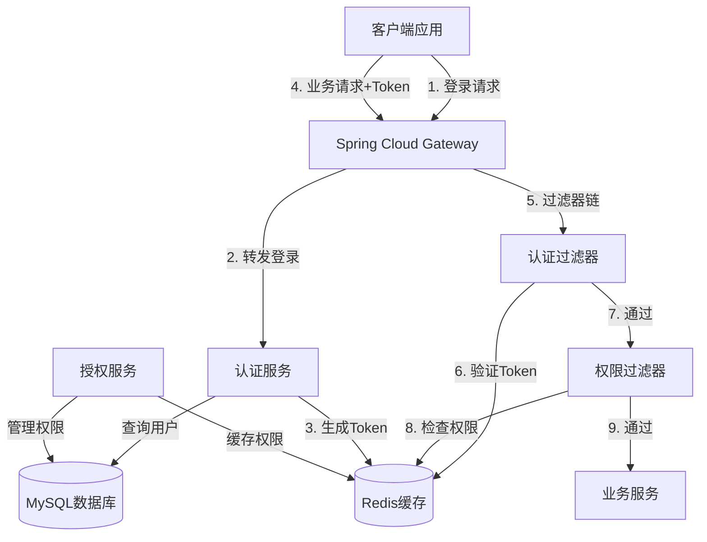

# 设计文档

## 概述

用户认证授权系统采用基于JWT的无状态认证方案，结合Redis缓存和RBAC权限模型，在Spring Cloud Gateway层实现统一的认证授权拦截。系统分为认证服务和授权服务两个核心模块，通过网关过滤器链实现请求的安全控制。

## 架构设计

### 系统架构图



### 模块划分

#### 1. Gateway模块（gateway）
- **职责**：统一入口，认证授权拦截
- **组件**：
  - `JwtAuthenticationFilter`：JWT令牌验证过滤器
  - `PermissionAuthorizationFilter`：权限检查过滤器
  - `GatewayConfig`：网关路由配置

#### 2. 认证服务模块（auth-service）
- **职责**：用户认证、令牌管理、用户管理
- **组件**：
  - `AuthController`：登录、登出、刷新令牌接口
  - `UserController`：用户管理接口
  - `AuthService`：认证业务逻辑
  - `JwtTokenProvider`：JWT令牌生成和解析
  - `UserService`：用户管理业务逻辑

#### 3. 授权服务模块（authz-service）
- **职责**：角色权限管理、菜单管理
- **组件**：
  - `RoleController`：角色管理接口
  - `PermissionController`：权限管理接口
  - `MenuController`：菜单管理接口
  - `RoleService`：角色业务逻辑
  - `PermissionService`：权限业务逻辑
  - `MenuService`：菜单业务逻辑

#### 4. 公共模块（common）
- **职责**：共享实体、工具类、常量
- **组件**：
  - 实体类（User, Role, Permission, Menu等）
  - Redis工具类
  - 响应结果封装类
  - 常量定义

## 组件和接口设计

### 1. JWT令牌提供者（JwtTokenProvider）

```java
public class JwtTokenProvider {
    private String secretKey;
    private long validityInMilliseconds;
    
    /**
     * 生成JWT令牌
     * @param userId 用户ID
     * @param username 用户名
     * @param roles 角色列表
     * @return JWT令牌字符串
     */
    public String generateToken(Long userId, String username, List<String> roles);
    
    /**
     * 从令牌中提取用户ID
     * @param token JWT令牌
     * @return 用户ID
     */
    public Long getUserIdFromToken(String token);
    
    /**
     * 从令牌中提取用户名
     * @param token JWT令牌
     * @return 用户名
     */
    public String getUsernameFromToken(String token);
    
    /**
     * 从令牌中提取角色列表
     * @param token JWT令牌
     * @return 角色列表
     */
    public List<String> getRolesFromToken(String token);
    
    /**
     * 验证令牌是否有效
     * @param token JWT令牌
     * @return 是否有效
     */
    public boolean validateToken(String token);
    
    /**
     * 获取令牌剩余有效期（毫秒）
     * @param token JWT令牌
     * @return 剩余有效期
     */
    public long getRemainingValidity(String token);
}
```

### 2. 认证服务（AuthService）

```java
public interface AuthService {
    /**
     * 用户登录
     * @param username 用户名
     * @param password 密码
     * @return 登录响应（包含令牌、用户信息、菜单）
     */
    LoginResponse login(String username, String password);
    
    /**
     * 用户登出
     * @param userId 用户ID
     */
    void logout(Long userId);
    
    /**
     * 刷新令牌
     * @param oldToken 旧令牌
     * @return 新令牌
     */
    String refreshToken(String oldToken);
    
    /**
     * 验证令牌
     * @param token JWT令牌
     * @return 是否有效
     */
    boolean validateToken(String token);
    
    /**
     * 记录登录失败
     * @param username 用户名
     * @return 是否需要锁定账户
     */
    boolean recordLoginFailure(String username);
    
    /**
     * 检查账户是否被锁定
     * @param username 用户名
     * @return 是否被锁定
     */
    boolean isAccountLocked(String username);
}
```

### 3. 权限服务（PermissionService）

```java
public interface PermissionService {
    /**
     * 检查用户是否有权限访问资源
     * @param userId 用户ID
     * @param resourcePath 资源路径
     * @param method HTTP方法
     * @return 是否有权限
     */
    boolean hasPermission(Long userId, String resourcePath, String method);
    
    /**
     * 获取用户所有权限
     * @param userId 用户ID
     * @return 权限列表
     */
    List<Permission> getUserPermissions(Long userId);
    
    /**
     * 清除用户权限缓存
     * @param userId 用户ID
     */
    void clearUserPermissionCache(Long userId);
    
    /**
     * 批量清除用户权限缓存
     * @param userIds 用户ID列表
     */
    void clearUserPermissionCacheBatch(List<Long> userIds);
}
```

### 4. 菜单服务（MenuService）

```java
public interface MenuService {
    /**
     * 获取用户菜单树
     * @param userId 用户ID
     * @return 菜单树
     */
    List<MenuTreeNode> getUserMenuTree(Long userId);
    
    /**
     * 构建菜单树
     * @param menus 菜单列表
     * @return 菜单树
     */
    List<MenuTreeNode> buildMenuTree(List<Menu> menus);
}
```

### 5. 网关认证过滤器（JwtAuthenticationFilter）

```java
@Component
public class JwtAuthenticationFilter implements GlobalFilter, Ordered {
    private JwtTokenProvider jwtTokenProvider;
    private RedisTemplate<String, String> redisTemplate;
    private List<String> whiteList; // 白名单路径
    
    @Override
    public Mono<Void> filter(ServerWebExchange exchange, GatewayFilterChain chain) {
        // 1. 检查是否在白名单中
        // 2. 提取Authorization头
        // 3. 验证JWT令牌格式和签名
        // 4. 从Redis验证令牌是否存在
        // 5. 检查令牌是否需要刷新
        // 6. 将用户信息添加到请求头
        // 7. 继续过滤器链
    }
    
    @Override
    public int getOrder() {
        return -100; // 优先级高，先执行
    }
}
```

### 6. 网关权限过滤器（PermissionAuthorizationFilter）

```java
@Component
public class PermissionAuthorizationFilter implements GlobalFilter, Ordered {
    private PermissionService permissionService;
    
    @Override
    public Mono<Void> filter(ServerWebExchange exchange, GatewayFilterChain chain) {
        // 1. 从请求头提取用户ID
        // 2. 获取请求路径和方法
        // 3. 调用权限服务检查权限
        // 4. 如果无权限返回403
        // 5. 继续过滤器链
    }
    
    @Override
    public int getOrder() {
        return -90; // 在认证过滤器之后执行
    }
}
```

## 数据模型

### 实体类设计

#### User（用户）
```java
public class User {
    private Long id;
    private String username;
    private String password;
    private String nickname;
    private String email;
    private String phone;
    private Integer status; // 0-正常 1-禁用
    private LocalDateTime createTime;
    private LocalDateTime lastLoginTime;
}
```

#### Role（角色）
```java
public class Role {
    private Long id;
    private String roleName;
    private String roleKey;
    private String description;
    private Integer status;
    private LocalDateTime createTime;
}
```

#### Permission（权限）
```java
public class Permission {
    private Long id;
    private String permissionName;
    private String permissionKey;
    private String resourceType; // menu/button/api
    private String resourcePath;
    private String method; // GET/POST/PUT/DELETE
    private String description;
}
```

#### Menu（菜单）
```java
public class Menu {
    private Long id;
    private Long parentId;
    private String menuName;
    private String menuPath;
    private String component;
    private String icon;
    private Integer sortOrder;
    private Integer visible; // 0-显示 1-隐藏
    private Integer status;
}
```

#### MenuTreeNode（菜单树节点）
```java
public class MenuTreeNode {
    private Long id;
    private Long parentId;
    private String menuName;
    private String menuPath;
    private String component;
    private String icon;
    private Integer sortOrder;
    private List<MenuTreeNode> children;
}
```

### Redis数据结构

#### 令牌存储
- **Key**: `token:{userId}`
- **Value**: JWT令牌字符串
- **过期时间**: 2小时

#### 权限缓存
- **Key**: `permission:{userId}`
- **Value**: JSON序列化的权限列表
- **过期时间**: 30分钟

#### 登录失败计数
- **Key**: `login:fail:{username}`
- **Value**: 失败次数
- **过期时间**: 15分钟

#### 账户锁定标记
- **Key**: `account:locked:{username}`
- **Value**: "1"
- **过期时间**: 15分钟

### 数据库表设计

#### sys_user（用户表）
```sql
CREATE TABLE sys_user (
    id BIGINT PRIMARY KEY AUTO_INCREMENT,
    username VARCHAR(50) NOT NULL UNIQUE,
    password VARCHAR(100) NOT NULL,
    nickname VARCHAR(50),
    email VARCHAR(100),
    phone VARCHAR(20),
    status TINYINT DEFAULT 0,
    create_time DATETIME DEFAULT CURRENT_TIMESTAMP,
    last_login_time DATETIME,
    INDEX idx_username (username)
);
```

#### sys_role（角色表）
```sql
CREATE TABLE sys_role (
    id BIGINT PRIMARY KEY AUTO_INCREMENT,
    role_name VARCHAR(50) NOT NULL,
    role_key VARCHAR(50) NOT NULL UNIQUE,
    description VARCHAR(200),
    status TINYINT DEFAULT 0,
    create_time DATETIME DEFAULT CURRENT_TIMESTAMP
);
```

#### sys_permission（权限表）
```sql
CREATE TABLE sys_permission (
    id BIGINT PRIMARY KEY AUTO_INCREMENT,
    permission_name VARCHAR(50) NOT NULL,
    permission_key VARCHAR(100) NOT NULL UNIQUE,
    resource_type VARCHAR(20),
    resource_path VARCHAR(200),
    method VARCHAR(10),
    description VARCHAR(200)
);
```

#### sys_menu（菜单表）
```sql
CREATE TABLE sys_menu (
    id BIGINT PRIMARY KEY AUTO_INCREMENT,
    parent_id BIGINT DEFAULT 0,
    menu_name VARCHAR(50) NOT NULL,
    menu_path VARCHAR(200),
    component VARCHAR(200),
    icon VARCHAR(50),
    sort_order INT DEFAULT 0,
    visible TINYINT DEFAULT 0,
    status TINYINT DEFAULT 0
);
```

#### sys_user_role（用户角色关联表）
```sql
CREATE TABLE sys_user_role (
    user_id BIGINT NOT NULL,
    role_id BIGINT NOT NULL,
    PRIMARY KEY (user_id, role_id)
);
```

#### sys_role_permission（角色权限关联表）
```sql
CREATE TABLE sys_role_permission (
    role_id BIGINT NOT NULL,
    permission_id BIGINT NOT NULL,
    PRIMARY KEY (role_id, permission_id)
);
```

#### sys_menu_permission（菜单权限关联表）
```sql
CREATE TABLE sys_menu_permission (
    menu_id BIGINT NOT NULL,
    permission_id BIGINT NOT NULL,
    PRIMARY KEY (menu_id, permission_id)
);
```

## 正确性属性

*属性是一个特征或行为，应该在系统的所有有效执行中保持为真——本质上是关于系统应该做什么的形式化陈述。属性作为人类可读规范和机器可验证正确性保证之间的桥梁。*

### 属性 1：令牌生成和验证往返一致性
*对于任何*有效的用户ID、用户名和角色列表，生成JWT令牌后再解析，应该得到相同的用户ID、用户名和角色列表
**验证需求：1.5, 2.1**

### 属性 2：密码加密不可逆性
*对于任何*明文密码，使用BCrypt加密后的结果不应该等于原始密码，且同一密码多次加密结果应该不同
**验证需求：7.1**

### 属性 3：登录失败计数单调递增
*对于任何*用户名，连续记录登录失败时，失败计数应该单调递增，直到达到锁定阈值或过期
**验证需求：1.4**

### 属性 4：权限检查传递性
*对于任何*用户，如果用户拥有角色A，角色A拥有权限P，则用户应该拥有权限P
**验证需求：3.2, 4.3**

### 属性 5：菜单树结构完整性
*对于任何*菜单列表，构建的菜单树应该包含所有菜单项，且每个菜单项只出现一次，父子关系正确
**验证需求：5.3**

### 属性 6：令牌过期时间单调性
*对于任何*JWT令牌，其剩余有效期应该随时间单调递减，直到过期
**验证需求：2.2**

### 属性 7：权限缓存一致性
*对于任何*用户，清除权限缓存后重新加载的权限列表应该与数据库中的权限列表一致
**验证需求：3.4**

### 属性 8：白名单路径跳过认证
*对于任何*在白名单中的请求路径，认证过滤器应该直接放行，不进行令牌验证
**验证需求：6.3**

### 属性 9：用户登出令牌失效
*对于任何*用户，登出后其JWT令牌应该从Redis中删除，后续使用该令牌的请求应该被拒绝
**验证需求：2.5**

### 属性 10：角色权限修改影响所有用户
*对于任何*角色，修改其权限后，所有拥有该角色的用户的权限缓存应该被清除
**验证需求：3.4**

## 错误处理

### 认证错误
- **401 Unauthorized**：令牌无效、过期或缺失
- **账户锁定**：登录失败次数过多，返回锁定剩余时间
- **用户不存在**：返回"用户名或密码错误"（不暴露具体信息）
- **密码错误**：返回"用户名或密码错误"，记录失败次数

### 授权错误
- **403 Forbidden**：用户无权限访问资源
- **角色不存在**：分配角色时检查角色是否存在
- **权限不存在**：分配权限时检查权限是否存在

### 系统错误
- **Redis连接失败**：降级到数据库查询，记录错误日志
- **数据库连接失败**：返回503服务不可用
- **JWT签名错误**：返回401，记录安全事件

### 业务错误
- **用户名已存在**：创建用户时返回409冲突
- **用户已禁用**：登录时返回账户已禁用错误
- **令牌刷新失败**：旧令牌无效时返回401，要求重新登录

## 测试策略

### 单元测试
使用JUnit 5和Mockito进行单元测试：
- 测试JWT令牌生成和解析的正确性
- 测试BCrypt密码加密和验证
- 测试登录失败计数逻辑
- 测试菜单树构建算法
- 测试权限检查逻辑

### 属性测试
使用jqwik进行基于属性的测试：
- 每个属性测试运行至少100次迭代
- 使用随机生成的用户数据、角色、权限进行测试
- 测试标签格式：**Feature: user-authentication-authorization, Property {number}: {property_text}**

### 集成测试
- 测试网关过滤器链的完整流程
- 测试认证服务与Redis的交互
- 测试授权服务与数据库的交互
- 使用TestContainers启动Redis和MySQL容器

### 安全测试
- 测试暴力破解防护机制
- 测试JWT令牌篡改检测
- 测试权限绕过尝试
- 测试SQL注入防护
