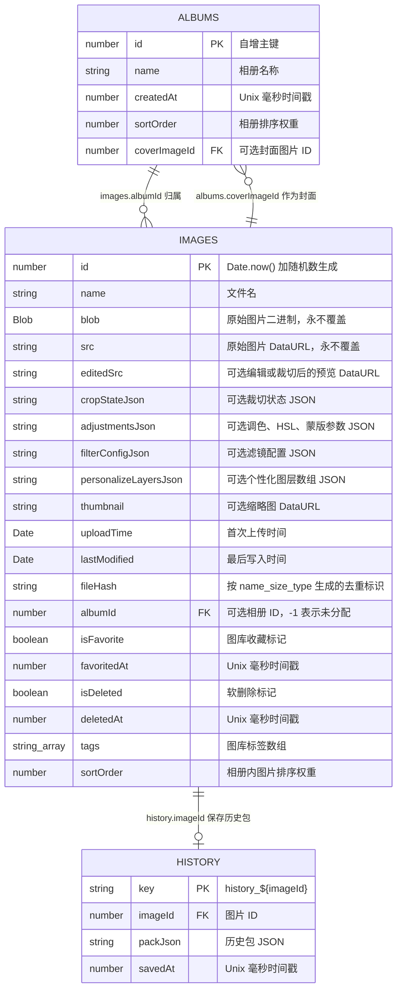

# IndexedDB ER 图

本文档根据实际代码整理，核心来源为：

- `management-vue-project/src/views/workstation/utils/imageDB.ts`
- `management-vue-project/src/views/workstation/utils/ImageRepository.ts`
- `management-vue-project/src/views/workstation/utils/AlbumRepository.ts`
- `management-vue-project/src/views/workstation/utils/HistoryRepository.ts`
- `management-vue-project/src/views/gallery/composables/useGalleryDB.ts`
- `management-vue-project/src/utils/gsj/gsjTypes.ts`

## 数据库概览

| 项目 | 值 |
|---|---|
| 数据库名 | `WorkstationDB` |
| 当前版本 | `9` |
| 对象仓库 | `images`、`history`、`albums` |
| 主要用途 | 浏览器本地保存图片、相册、调色/裁切/滤镜/个性化图层参数、撤销重做历史 |

## ER 图



## 关系说明

| 关系 | 基数 | 代码依据 | 说明 |
|---|---|---|---|
| `albums.id` -> `images.albumId` | 1 对多 | `getImagesByAlbum()`、`deleteAlbum()` | 一个相册包含多张图片。`albumId = -1` 表示工作台直接上传的未分配图片，不一定对应真实相册记录。 |
| `images.id` -> `history.imageId` | 1 对 0/1 | `saveHistoryPack()` | 每张图片最多保存一条历史包，主键固定为 `history_${imageId}`。 |
| `images.id` -> `albums.coverImageId` | 1 对多 | `AlbumRecord.coverImageId` | 相册可选择一张图片作为封面。同一张图片理论上可被多个相册引用为封面，代码未加唯一约束。 |

IndexedDB 本身不强制外键约束，上面的 FK 是业务层约定。实际删除行为如下：

- `deleteImage(id)` 会删除 `images` 中的图片，并通过 `history.imageId` 索引删除该图片的历史记录。
- `deleteAlbum(id)` 会删除 `albums` 中的相册，并删除 `images.albumId = id` 的图片记录；当前实现没有同步清理这些图片对应的 `history` 记录。

## 对象仓库与索引

### images

| 项目 | 值 |
|---|---|
| keyPath | `id` |
| autoIncrement | 否 |
| 索引 | `uploadTime`、`name`、`fileHash`、`albumId`、`isFavorite`、`isDeleted` |

### history

| 项目 | 值 |
|---|---|
| keyPath | `key` |
| autoIncrement | 否 |
| 索引 | `imageId` |

### albums

| 项目 | 值 |
|---|---|
| keyPath | `id` |
| autoIncrement | 是 |
| 索引 | `createdAt`、`sortOrder` |

## JSON 字段子结构

这些字段在 IndexedDB 中以字符串保存，不单独建表。

### `images.cropStateJson`

```ts
interface CropState {
  rotate: number
  flipH: boolean
  flipV: boolean
  rect: { x: number; y: number; w: number; h: number } | null
}
```

### `images.adjustmentsJson`

保存基础调色、HSL 分区调色和蒙版参数。蒙版中的 `canvas` 不会序列化，恢复时按参数重建。

```ts
interface AdjustmentsPayload {
  adjustments: AdjustmentValues
  hslAdjustments: HSLAdjustments
  mask: SerializedMaskLayer[]
}
```

### `images.filterConfigJson`

保存滤镜配置，字段由滤镜模块的 `FilterConfig` 决定。

### `images.personalizeLayersJson`

保存个性化图层数组。运行时图层使用像素坐标，持久化时保存百分比坐标。

```ts
interface LayerStorageData {
  id: string
  name: string
  type: "image" | "text" | "shape"
  visible: boolean
  locked: boolean
  opacity: number
  xPercent: number
  yPercent: number
  widthPercent: number
  heightPercent: number
  rotation: number
  zIndex: number
  imageUrl?: string
  text?: string
  fontSizePercent?: number
  fontFamily?: string
  color?: string
  shapeType?: string
  fillColor?: string
  strokeColor?: string
  strokeWidthPercent?: number
}
```

### `history.packJson`

历史记录整包保存，每张图片一条记录。

```ts
interface HistoryPack {
  base: HistorySnapshot
  diffs: Partial<HistorySnapshot>[]
  cursor: number
}

interface HistorySnapshot {
  adjustments: AdjustmentValues
  hslAdjustments: HSLAdjustments
  maskLayers: SerializedMaskLayer[]
  cropState: CropState
  imageSrc: string
}
```

## 版本演进

| 版本 | 变更 |
|---|---|
| v1 | 创建 `images`，包含 `id`、`name`、`blob`、`src`、`uploadTime`、`lastModified` 等基础字段 |
| v2 | 为 `images.fileHash` 添加索引，用于上传去重 |
| v3 | 无 IndexedDB 结构变更 |
| v4 | 新增普通字段 `adjustmentsJson` |
| v5 | 新增普通字段 `editedSrc`、`cropStateJson` |
| v6 | 新增 `history`，索引 `imageId` |
| v7 | 新增 `albums`；为 `images` 添加 `albumId`、`isFavorite`、`isDeleted` 索引 |
| v8 | 新增普通字段 `personalizeLayersJson` |
| v9 | 新增普通字段 `filterConfigJson` |
